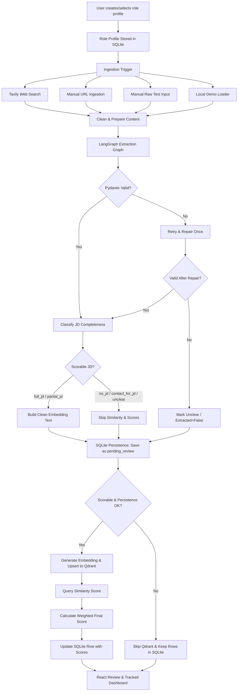

# Agentic Job Matching System MVP

The **Agentic Job Matching System MVP** is a portfolio-ready, full-stack application designed to help users match, extract, score, and track job postings against target role profiles. It utilizes agentic workflows to handle unstructured data (raw text, URLs, search results), classifies job description completeness, scores candidates deterministically across several vectors, and features a sleek, OLED-black React dashboard for human-in-the-loop review.

---

## System Architecture

The application is built on a **SQLite-first, Qdrant-sync** architecture. SQLite serves as the durable transactional source of truth, while Qdrant acts as a derived, sync-on-commit index for high-dimensional vector similarity matching.

```
                                +-----------------------------+
                                |      Vite + React UI        |
                                +--------------+--------------+
                                               | (FastAPI REST API)
                                               v
                                +-----------------------------+
                                |       FastAPI Backend       |
                                +-------+--------------+------+
                                        |              |
                 (SQLAlchemy Async)     |              |  (Qdrant Client Async)
                                        v              v
                         +--------------+---+    +-----+-------------+
                         |  SQLite Database |    | Qdrant Vector DB  |
                         | (Durable State)  |    |  (Similarity)     |
                         +------------------+    +-------------------+
```

### Processing & Extraction Pipeline Flow

When raw job input is ingested, the backend runs a structured extraction and scoring workflow:



---

## Directory Structure

The project code is organized as follows:

```text
Job_Agent/
|-- backend/
|   |-- app/
|   |   |-- api/
|   |   |   |-- routes_batches.py        # Ingestion batch metrics endpoints
|   |   |   |-- routes_jobs.py           # Ingest, review, status, and detail routes
|   |   |   |-- routes_role_profiles.py  # Target profile CRUD routes
|   |   |   `-- schemas.py               # Pydantic request/response API schemas
|   |   |-- agents/
|   |   |   |-- graph.py                 # LangGraph extraction graph & edges
|   |   |   |-- nodes.py                 # Side-effect-free extraction nodes
|   |   |   |-- prompts.py               # Extraction & validation repair prompts
|   |   |   `-- schemas.py               # LangGraph state & schema definitions
|   |   |-- core/
|   |   |   |-- config.py                # Environment configuration loader
|   |   |   |-- constants.py             # Shared application constants
|   |   |   `-- logging.py               # Backend logging configuration
|   |   |-- db/
|   |   |   |-- models.py                # SQLite ORM models (SQLAlchemy)
|   |   |   `-- session.py               # Async database engine & session pool
|   |   |-- main.py                      # FastAPI app entry point & startup hooks
|   |   |-- services/
|   |   |   |-- cost_service.py          # LLM cost and token usage aggregator
|   |   |   |-- dedup_service.py         # Deterministic exact & fuzzy duplicate checker
|   |   |   |-- demo_loader.py           # Mock job loader & database reset service
|   |   |   |-- embedding_service.py     # OpenAI embedding client wrapper
|   |   |   |-- extraction_service.py    # URL/text preparation and graph runner
|   |   |   |-- job_processing_service.py# SQL persistence, Qdrant scoring, & status mutations
|   |   |   |-- llm_client.py            # OpenAI chat client wrapper
|   |   |   |-- qdrant_service.py        # Qdrant client vector index controller
|   |   |   |-- scoring_service.py       # Multi-criteria scoring calculator
|   |   |   `-- search_service.py        # Tavily search wrapper
|   |-- data/
|   |   `-- job_matching.db              # SQLite Database file (Local)
|   |-- scripts/
|   |   |-- export_api_contract.py       # Exports backend routing schema to shared JSON
|   |   `-- seed_demo.py                 # Seed demo jobs into the database
|   |-- tests/                           # Pytest unit and integration test suite
|   |-- requirements.txt                 # Backend production dependencies
|   |-- requirements-dev.txt             # Development and testing dependencies
|   `-- Dockerfile                       # Backend container definition
|-- frontend/
|   `-- job-agent-ui/                    # Vite + React + TypeScript web app
|       |-- src/
|       |   |-- api/
|       |   |   `-- client.ts            # Typed Axios client mapping FastAPI endpoints
|       |   |-- components/
|       |   |   |-- AppShell.tsx         # Layout shell, navigation, and global layout
|       |   |   |-- BatchMetrics.tsx     # Cost, tokens, and conversion panel
|       |   |   |-- IngestionPanel.tsx   # Text, URL, Search, and Mock loaders
|       |   |   |-- JobCard.tsx          # Display component with status controls
|       |   |   |-- RoleProfilePanel.tsx # Role creation & profile select dropdown
|       |   |   |-- ScoreBreakdown.tsx   # Detailed match score overlay panel
|       |   |   `-- StatusSelect.tsx     # Contract-validated status controls
|       |   |-- pages/
|       |   |   |-- DashboardPage.tsx    # Live application pipeline/kanban
|       |   |   `-- ReviewPage.tsx       # Incoming job review queue
|       |   |-- styles/
|       |   |   `-- app.css              # OLED Dark + Cyan theme styling
|       |   |-- test/                    # Vitest component & contract compliance tests
|       |   |-- types/
|       |   |   `-- api.ts               # Shared models generated from API contract
|       |   `-- utils/
|       |       `-- activeBatchStorage.ts# Profile-specific active batch local storage
|-- mock_data/
|   |-- demo_jobs.json                   # Structured mock job data
|   `-- messy_social_posts.json          # Unstructured job texts
|-- shared/
|   `-- api-contract.json                # Generated backend API contract schema
|-- docker-compose.yml                   # Docker Compose for Qdrant service
`-- .env.example                         # Environment variable configuration template
```

---

## Core System Features

### 1. Ingestion Sources
- **Manual Text Ingestion:** Paste unstructured description text directly. Low-content validation fails gracefully (skipping the LLM extraction) if inputs are less than 150 characters.
- **URL Ingestion:** Paste job board links. Backend fetches HTML asynchronously via `httpx`, extracts content with `trafilatura`, and processes the result.
- **Tavily Web Search:** Run search queries directly from the UI. Tavily searches the web for matching links, extracts pages, and runs them parallelly through the processing pipeline.
- **Demo Mode Loading:** Populate the SQLite DB with pre-configured mock fixtures (`demo_jobs.json`, `messy_social_posts.json`) to demonstrate system capabilities offline.

### 2. LangGraph Extraction Graph & Observability
An agentic extraction workflow built on LangGraph ensures robust data structured output:
- **`prepare_content`**: Normalizes raw inputs, URL content, and metadata.
- **`extract_job`**: Call OpenAI models using structured JSON schemas to populate `JobPostExtract` fields.
- **`repair_job`**: In case of schema parsing or validation issues, the graph runs a single repair attempt supplying the error traceback to correct schema mistakes.
- **`classify_jd`**: Inspects if the job contains detailed specifications or just short summaries, classifying completeness into: `full_jd`, `partial_jd`, `contact_for_jd`, `no_jd`, or `unclear`.
- **Token & Cost Tracking**: All token usage, API request costs, and extraction latencies are aggregated monotonically across the graph execution steps and returned in the state.

### 3. Deduplication & Persistence Policy
To maintain database integrity, incoming jobs run through a clean deduplication pipeline *before* vector index embedding calculation:
- Normalizes titles and companies (whitespace trimming, case-insensitivity).
- Generates a SHA-256 fingerprint hash when both fields exist.
- Skips duplicate jobs already in progress or tracked, avoiding redundant vector DB transactions.
- Handles database exceptions gracefully, completing the SQLite transaction before committing vectors.

### 4. Multi-Criteria Scoring Engine
Scorable jobs receive an overall weighted matching score calculated by the `scoring_service.py`:
- **Location Matching (20%)**: Checks Onsite/Hybrid/Remote alignment.
- **Level Matching (10%)**: Gaps in experience requirements. Gaps > 2 levels reduce match score, while adjacent matches score partially.
- **Skill Overlap (30%)**: Matches role profile skills against extracted job skills. Includes alias normalization (e.g. mapping `reactjs` and `react` together).
- **Cosine Embedding Similarity (40%)**: Calculates vector similarity between the embedding of the clean role profile and the embedding of the clean job posting via Qdrant.
- **Confidence Multiplier**: Multiplies final score by the extraction confidence score.

### 5. human-in-the-loop Review Queue & Dashboard
- **Review Queue:** Newly ingested jobs arrive as `pending_review`. Users can review the match breakdowns and choose to approve (`saved`) or reject (`ignored`).
- **Dashboard Tracking:** Approved jobs are displayed on the tracked pipeline dashboard where users manually advance them across standard application milestones: `saved` -> `applied` -> `interview` -> `offer` / `rejected`.
- **Contract-Based Transitions:** State transitions are dynamically constrained to backend-configured routes defined in `api-contract.json` to prevent invalid workflow progressions.

---

## Setup & Installation

### Prerequisite Checklist
- **OS:** Windows (PowerShell/CMD), macOS, or Linux.
- **Python:** 3.11 or higher.
- **Node.js:** 18 or higher (with `npm`).
- **Docker:** Installed and running (for local Qdrant).

### 1. Environment Configuration
Copy the template `.env` file to the root of the project:
```bash
cp .env.example .env
```
Open `.env` and fill out your keys:
- **`OPENAI_API_KEY`**: Required for OpenAI LLM extraction and vector embeddings.
- **`TAVILY_API_KEY`**: Required for the web search ingestion feature.
- **Other variables** (e.g., ports, model names, timeouts) can be kept at their default settings.

### 2. Launch Infrastructure (Qdrant)
Run the local Qdrant vector database container:
```bash
docker compose up -d qdrant
```
This launches Qdrant at `http://localhost:6333` with data persisted to local Docker volumes.

### 3. Backend Installation & Database Setup
Create and activate a virtual environment, then install requirements:
```bash
cd backend
python -m venv .venv

# Activate:
# On Windows (PowerShell):
.venv\Scripts\Activate.ps1
# On macOS/Linux:
source .venv/bin/activate

# Install dependencies:
pip install -r requirements-dev.txt
```

Initialize the database schema (SQLite `job_matching.db` will be created inside `backend/data/`):
```bash
python -c "import asyncio; from app.db.session import init_db; asyncio.run(init_db())"
```

Verify that the FastAPI application compiles and lists its endpoints:
```bash
python -c "from app.main import app; print(app.title)"
python -c "from app.main import app; print(sorted(app.openapi()['paths']))"
```

### 4. Seed Demo Data (Optional but recommended)
Seed initial data for testing. Make sure Qdrant is running and `OPENAI_API_KEY` is configured in your `.env`:
```bash
python scripts/seed_demo.py --reset
```
This creates a default "AI Engineer Intern" profile, ingests mock job records, calculates similarity embeddings, and populates the SQLite and Qdrant databases.

### 5. Frontend Setup
Navigate to the UI folder and install dependencies:
```bash
cd ../frontend/job-agent-ui
npm install
```

---

## Running the Application

To run the complete system locally, start both the backend and frontend servers:

### 1. Start the FastAPI Backend
Ensure your virtual environment is active in the `backend` folder, then run:
```bash
uvicorn app.main:app --reload --port 8000
```
- API Documentation (Swagger UI): [http://localhost:8000/docs](http://localhost:8000/docs)
- API Alt UI (Redoc): [http://localhost:8000/redoc](http://localhost:8000/redoc)

### 2. Start the React Frontend
In the `frontend/job-agent-ui` folder, run:
```bash
npm run dev
```
Open [http://localhost:5173](http://localhost:5173) in your web browser.

---

## Testing & Verification

The project is backed by comprehensive, isolated backend and frontend test suites to ensure contract freshness and prevent regressions.

### Backend Testing (Pytest)
Run the full backend test suite:
```bash
cd backend
pytest
```
- The backend suite mocks LLM network calls, embeddings, and Qdrant indices to enable fast, offline, and deterministic verification.
- To verify the API contract remains in sync with backend routes:
  ```bash
  python scripts/export_api_contract.py
  pytest tests/test_api_contract_export.py
  ```

### Frontend Testing (Vitest)
Run the frontend test suite:
```bash
cd frontend/job-agent-ui
npm run typecheck
npm test -- --run
```
- The frontend tests check component renders, Ingestion, Review, and Dashboard layouts.
- Includes API contract drift validation matching models to `shared/api-contract.json`.

---

## Scoring Mechanics Reference

For reference, the mathematical formulas used to evaluate candidates' matches to jobs are structured as follows:

1. **Skill Match Score (\(S_{\text{skill}}\))**:
   \[
   S_{\text{skill}} = \frac{|R_{\text{skills}} \cap J_{\text{skills}}|}{|R_{\text{skills}}|}
   \]
   Where \(R_{\text{skills}}\) are target profile skills (normalized using aliases) and \(J_{\text{skills}}\) are extracted job requirements.

2. **Level Match Score (\(S_{\text{level}}\))**:
   - Exact level match = `1.0`
   - Adjacent level match (e.g. Intern vs Junior) = `0.5`
   - Gap > 2 levels = `0.0`

3. **Location Match Score (\(S_{\text{location}}\))**:
   - Exact Match (e.g. Remote to Remote) = `1.0`
   - Hybrid match when Remote requested = `0.5`
   - Onsite match when Remote requested = `0.0`

4. **Embedding Similarity (\(S_{\text{embedding}}\))**:
   - Cosine similarity calculated directly by Qdrant over target profile text and job description content.

5. **Weighted Total Match Score (\(M\))**:
   \[
   M = \left(0.40 \cdot S_{\text{embedding}} + 0.30 \cdot S_{\text{skill}} + 0.20 \cdot S_{\text{location}} + 0.10 \cdot S_{\text{level}}\right) \times C_{\text{extraction}}
   \]
   Where \(C_{\text{extraction}}\) is the LLM-reported extraction confidence scale (`0.0` - `1.0`).
