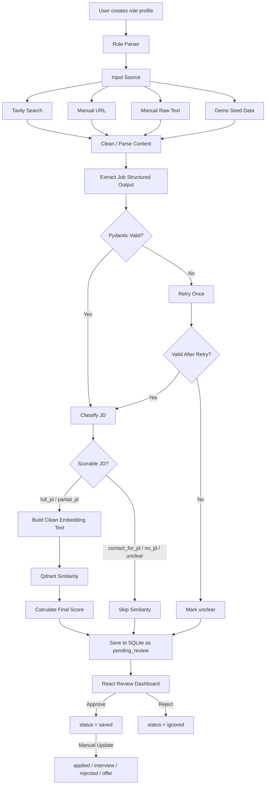
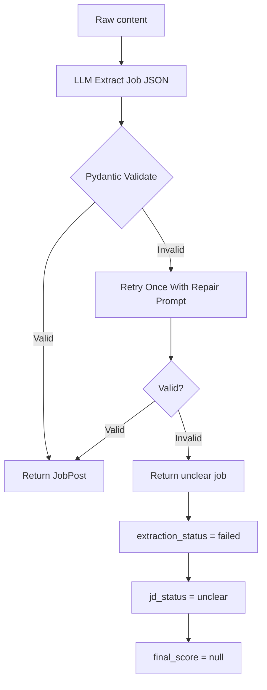

# Agentic Job Matching System MVP

**Version:** MVP v2.5 SQLite + Qdrant Local Dedup/Qdrant Sync Clarified  
**Stack:** FastAPI + LangChain/LangGraph + SQLite + Qdrant Local + React  
**Goal:** A realistic, portfolio-ready job matching system that can run reliably during a live demo.

---

## 1. System Objective

The **Agentic Job Matching System MVP** helps users find jobs that match a target role, extract structured job information, classify JD completeness, calculate a normalized match score, and review jobs before saving or tracking applications.

This version is optimized for:

- A solo developer implementation.
- A reliable portfolio demo.
- Fast live interview walkthroughs.
- Clear AI/LLM engineering value.
- Minimal hidden infrastructure overhead.

---

## 2. Final MVP Stack

```text
Frontend:
- React + TypeScript + Vite

Backend:
- FastAPI

Agent / AI Layer:
- LangChain
- LangGraph
- Pydantic structured output

Database:
- SQLite local file via SQLAlchemy + aiosqlite

Vector Database:
- Qdrant local via Docker Compose with persistent volume

Search:
- Tavily API or similar public web search API

Demo Support:
- seed_demo.py
- Mock job JSON files

Infrastructure:
- Docker Compose for Qdrant local
- Local SQLite database file
- Single root .env file
```

---

## 3. MVP Scope

### In Scope

1. User creates a role profile.
2. User searches public web jobs through Tavily or similar search API.
3. User pastes a public job URL.
4. User pastes raw job text from LinkedIn/Facebook/social posts.
5. User runs Demo Mode using `seed_demo.py`.
6. Agent extracts job details into a validated JSON schema.
7. Agent classifies JD completeness.
8. Agent scores only jobs with `full_jd` or `partial_jd`.
9. Agent saves parsed jobs as `pending_review`.
10. User approves, rejects, or updates job status manually.
11. React dashboard shows ranked jobs and score breakdown.
12. React dashboard shows basic cost/performance metrics.

### Out of Scope

1. Auto applying to jobs.
2. Generating cover letters.
3. Authenticated LinkedIn/Facebook scraping.
4. Enterprise-grade URL security implementation.
5. Distributed queues such as Celery/Redis.
6. Multi-user authentication or organizations.

---

## 4. Architecture



Important rule:

```text
All parsed jobs are saved to SQLite first with status = pending_review.
User approval only changes status from pending_review to saved.
```

---

## 4.1. LangGraph State Tracking

LangGraph nodes should pass a shared state object through the entire workflow. The state must carry the core foreign keys and source metadata from the first node to the fallback node.

This prevents a failure in the middle of the graph from losing the context needed to write a reliable failure record to SQLite.

### Required State Fields

```python
from typing import Literal, TypedDict, Any


class JobAgentState(TypedDict, total=False):
    # Required identifiers that must survive every node
    batch_id: str
    role_profile_id: str
    input_source: Literal["tavily", "manual_url", "manual_text", "mock"]

    # Input payload
    source_url: str | None
    raw_text: str | None
    raw_content_hash: str | None

    # Processing state
    clean_text: str | None
    parse_status: Literal["success", "needs_manual_input", "failed"]
    extracted_job: dict[str, Any] | None
    jd_status: Literal["full_jd", "partial_jd", "contact_for_jd", "no_jd", "unclear"] | None

    # Scoring state
    embedding_text: str | None
    embedding_similarity: float | None
    skill_overlap_score: float | None
    location_match_score: float | None
    level_match_score: float | None
    base_score: float | None
    jd_confidence_multiplier: float | None
    final_score: float | None
    final_score_percent: float | None

    # Error / observability state
    extraction_status: Literal["success", "retried", "failed"] | None
    error_reason: str | None
    user_warning: str | None
    input_tokens: int | None
    output_tokens: int | None
    estimated_cost_usd: float | None
    extraction_time_ms: int | None
```

### Required Rule

```text
Every node must return partial updates without dropping:
- batch_id
- role_profile_id
- input_source
```

This is especially important for fallback nodes such as `mark_unclear`.

### Fallback Example

```python
async def mark_unclear(state: JobAgentState) -> JobAgentState:
    return {
        "batch_id": state["batch_id"],
        "role_profile_id": state["role_profile_id"],
        "input_source": state["input_source"],
        "jd_status": "unclear",
        "should_score_similarity": False,
        "embedding_similarity": None,
        "final_score": None,
        "extraction_status": "failed",
        "error_reason": state.get("error_reason") or "Extraction failed before schema validation",
    }
```

### Why This Matters

If `batch_id`, `role_profile_id`, or `input_source` disappears mid-graph, the system may fail to save failed extractions correctly. The result would be a silent failure instead of a visible `pending_review` or `unclear` record in SQLite.


---

## 5. Demo Mode / Mock Seeding

A portfolio demo must not depend entirely on internet latency, Tavily availability, JavaScript-heavy pages, or manual copy-paste.

Add a script:

```text
backend/scripts/seed_demo.py
```

This script should populate both SQLite and local Qdrant with demo-ready jobs.

### Demo Dataset Composition

| Job Type | Count | Purpose |
|---|---:|---|
| Perfect matches | 5 | Show strong ranking behavior |
| Partial matches | 3 | Show confidence penalty and realistic matching |
| Unrelated jobs | 2 | Show low scores and filtering |
| Messy social posts | 2 | Show `contact_for_jd` / `partial_jd` handling |

Example demo jobs:

```text
1. AI Engineer Intern - RAG + LangChain + FastAPI + Qdrant
2. LLM Application Intern - Python + OpenAI API + Vector DB
3. Backend Intern - FastAPI + SQLite, partial AI relevance
4. Data Analyst Intern - mostly unrelated
5. Social post: "Tuyển AI Intern, ib nhận JD"
```

### Seed Script Responsibilities

```text
1. Clear existing demo data if --reset is passed.
2. Create a demo role profile.
3. Insert demo jobs into SQLite.
4. For scorable jobs, build embedding_text.
5. Upsert vectors into local Qdrant.
6. Print demo account/profile/batch summary.
```

### Example Command

```powershell
cd backend
python scripts/seed_demo.py --reset
```

### Expected Output

```text
Seed completed.
Role profile: AI Engineer Intern
Inserted jobs: 12
Scorable jobs: 10
Need-review/social jobs: 2
Local Qdrant vectors upserted: 10
```

---

## 6. Input Sources

| Input Type | In MVP? | Notes |
|---|---:|---|
| Demo seed data | Yes | Must-have for live demo |
| Manual raw text | Yes | Best fallback for LinkedIn/Facebook |
| Manual public URL | Yes | Useful for controlled demos |
| Tavily public search | Yes | Real-world search capability |
| LinkedIn/Facebook crawler | No | Too unstable for MVP |

---

## 7. Handling JavaScript Pages and Cookie Banners

Tavily or URL parsing may return pages that are:

- JavaScript-rendered.
- Hidden behind cookie banners.
- Blocked by bot protection.
- Low-content HTML shells.
- Login-gated.

MVP handling strategy:

```text
1. Try normal HTTP fetch with httpx.
2. Extract readable text with trafilatura.
3. If extracted content is too short or irrelevant, mark parse_status = needs_manual_input.
4. Show UI warning: "This page could not be parsed reliably. Please paste the JD text manually."
```

Parsing dependency rule:

```text
Use trafilatura as the primary HTML-to-text extractor.
Do not add custom HTML parser logic in MVP unless trafilatura fails on a specific controlled demo source.
This keeps the crawler/parser surface area small and easier to maintain.
```

Do not implement Playwright/browser rendering in MVP unless absolutely necessary.

### UI Warning Example

```text
We could not extract enough job content from this URL.
The page may require JavaScript rendering, login, or cookie acceptance.
Please paste the job description text manually.
```

---

## 8. JD Status Rules

| `jd_status` | Description | Score? | Action |
|---|---|---:|---|
| `full_jd` | Clear responsibilities, requirements, and skills | Yes | Score and rank |
| `partial_jd` | Some useful JD info but incomplete | Yes | Score with confidence penalty |
| `contact_for_jd` | Says inbox/DM/comment for JD | No | Save as pending_review |
| `no_jd` | Hiring mention only, no useful JD | No | Save as pending_review or ignored |
| `unclear` | Extraction failed or content is unreliable | No | Save as pending_review |

---

## 9. Scoring Formula

MVP excludes Jina Reranker, so scoring uses clean deterministic components.

```text
base_score =
  0.55 * embedding_similarity
+ 0.25 * skill_overlap_score
+ 0.10 * location_match_score
+ 0.10 * level_match_score
```

Then apply JD confidence:

```text
final_score = base_score * jd_confidence_multiplier
final_score_percent = final_score * 100
```

All score components must be normalized to `[0, 1]`.

---

## 10. JD Confidence Multiplier

| JD Status | Multiplier |
|---|---:|
| `full_jd` | `1.00` |
| `partial_jd` | `0.85` |
| `contact_for_jd` | `null` |
| `no_jd` | `null` |
| `unclear` | `null` |

Example:

```text
base_score = 0.80
jd_status = partial_jd
jd_confidence_multiplier = 0.85
final_score = 0.68
```

---

## 11. Simplified Location and Level Scoring

To keep `scoring_service.py` simple, use three-tier scoring instead of complex tables.

### Location Match

| Case | Score |
|---|---:|
| Exact match | `1.0` |
| Remote acceptable or partial match | `0.5` |
| Mismatch | `0.0` |

### Level Match

| Case | Score |
|---|---:|
| Exact level match | `1.0` |
| Adjacent level match | `0.5` |
| Mismatch | `0.0` |

Examples:

```text
User target: intern
Job level: intern
level_match_score = 1.0

User target: intern
Job level: fresher
level_match_score = 0.5

User target: intern
Job level: senior
level_match_score = 0.0
```

---

## 12. Skill Overlap Normalization

`skill_overlap_score` must be normalized to `[0, 1]`.

```text
skill_overlap_score = matched_required_skills / total_required_skills
```

Example:

```text
User skills:
- Python
- LangChain
- RAG
- FastAPI

Job required skills:
- Python
- LangChain
- Docker
- SQLite

Matched:
- Python
- LangChain

skill_overlap_score = 2 / 4 = 0.5
```

Edge case:

```python
def calculate_skill_overlap_score(user_skills: set[str], job_required_skills: set[str]) -> float:
    if not job_required_skills:
        return 0.0

    matched = user_skills.intersection(job_required_skills)
    return len(matched) / len(job_required_skills)
```

---

## 13. Skill Alias Normalization

Raw skill strings should be normalized before matching.

| Raw Skill | Canonical Skill |
|---|---|
| `SQLite` | `sqlite` |
| `Retrieval-Augmented Generation` | `rag` |
| `Retrieval Augmented Generation` | `rag` |
| `Large Language Model` | `llm` |
| `Large Language Models` | `llm` |
| `Vector Database` | `vector db` |
| `JavaScript` | `js` |
| `TypeScript` | `typescript` |

Example:

```python
SKILL_ALIASES = {
    "sqlite": "sqlite",
    "retrieval augmented generation": "rag",
    "retrieval-augmented generation": "rag",
    "large language model": "llm",
    "large language models": "llm",
    "vector database": "vector db",
    "javascript": "js",
    "typescript": "typescript",
}


def normalize_skill(skill: str) -> str:
    value = skill.strip().lower()
    return SKILL_ALIASES.get(value, value)
```

---

## 14. Visual Score Breakdown in UI

The React dashboard should not only show the final score. Each job card should include a small accordion, tooltip, or modal showing score components.

### Job Card Summary

```text
AI Engineer Intern - ABC AI Lab
Final Score: 88%
JD Status: full_jd
Status: pending_review
[View Score Breakdown]
```

### Score Breakdown Popup

| Component | Score |
|---|---:|
| Semantic Similarity | 85% |
| Skill Overlap | 90% |
| Location Match | 100% |
| Level Match | 100% |
| JD Confidence | 100% |
| Final Score | 88% |

This makes the scoring logic visible and defensible during interviews.

---

## 15. Cost & Performance Metrics Panel

Since the system already stores token and cost fields, add a small dashboard widget.

### MVP Metrics

| Metric | Source |
|---|---|
| Total parsed jobs | Count rows in current batch |
| Total estimated cost | Sum `estimated_cost_usd` in frontend or simple SQL |
| Total input tokens | Sum `input_tokens` |
| Total output tokens | Sum `output_tokens` |
| Failed extractions | Count `extraction_status = failed` |
| Average extraction time | Optional field if implemented |

### UI Example

```text
Pipeline Metrics
- Jobs parsed: 12
- Scorable jobs: 10
- Failed extractions: 1
- Total tokens: 18,420
- Estimated cost: $0.043
```

Implementation note:

```text
Avoid background cron jobs or deep analytics tables in MVP.
Use stored per-job fields and simple frontend/SQL aggregation.
```

---

## 16. Simplified Deduplication Strategy

Do not use vector similarity for deduplication in MVP.

Use only:

```text
1. raw_content_hash
2. company + title unique-ish dedup key
```

Recommended fields:

```text
raw_content_hash
dedup_key
duplicate_of_job_id
```

Dedup key:

```text
dedup_key = hash(normalized_company + normalized_title)
```

This is enough for a demo and avoids extra vector queries.

### SQLite Constraints

```sql
CREATE UNIQUE INDEX idx_job_posts_raw_content_hash
ON job_posts(raw_content_hash)
WHERE raw_content_hash IS NOT NULL;

CREATE INDEX idx_job_posts_dedup_key
ON job_posts(dedup_key);
```

### Deduplication Update Rules

The system must not re-open jobs that the user already saved or tracked in a later batch.

Recommended MVP behavior:

```text
1. Compute raw_content_hash from cleaned raw content.
2. Compute dedup_key from normalized company + normalized title.
3. Check exact duplicate first by raw_content_hash.
4. If raw_content_hash already exists, skip inserting a new row and count it as skipped_exact_duplicate in the batch summary.
5. If dedup_key already exists, inspect the existing job status.
```

Dedup status policy:

| Existing job status | New duplicate from later batch | Reason |
|---|---|---|
| `pending_review` | Skip insert or insert with `duplicate_of_job_id` and `status = ignored` | Avoid showing the same job twice in review queue |
| `saved` | Insert only as duplicate metadata with `duplicate_of_job_id` and `status = ignored`, or skip insert | User already accepted this job |
| `applied` | Insert only as duplicate metadata with `duplicate_of_job_id` and `status = ignored`, or skip insert | User already applied; do not re-suggest it |
| `interview` | Insert only as duplicate metadata with `duplicate_of_job_id` and `status = ignored`, or skip insert | Job is already being tracked |
| `rejected` | Insert only as duplicate metadata with `duplicate_of_job_id` and `status = ignored`, or skip insert | User already reached an outcome |
| `offer` | Insert only as duplicate metadata with `duplicate_of_job_id` and `status = ignored`, or skip insert | User already reached an outcome |
| `ignored` | Skip insert | User already rejected/ignored this job |

Simplest implementation for MVP:

```python
TRACKED_STATUSES = {"saved", "applied", "interview", "rejected", "offer"}


def decide_duplicate_action(existing_job_status: str) -> str:
    if existing_job_status == "pending_review":
        return "skip_duplicate"
    if existing_job_status in TRACKED_STATUSES:
        return "mark_new_as_duplicate_ignored"
    if existing_job_status == "ignored":
        return "skip_duplicate"
    return "skip_duplicate"
```

If inserting duplicate metadata, use:

```text
duplicate_of_job_id = existing_job.id
status = ignored
should_score_similarity = false
final_score = null
```

The review queue and dashboard already exclude duplicates using:

```sql
AND duplicate_of_job_id IS NULL
```

This preserves the original user decision and prevents Batch 2 from pushing already-saved or already-applied jobs back into `pending_review`.

---

## 17. Smart Embedding Strategy

Do not embed raw HTML or full messy JD text.

### Do Not Embed

```text
About us
Company culture
Benefits
Legal footer
Cookie banner text
Navigation menu
Equal opportunity employer block
Random unrelated page content
```

### Embed Instead

```text
title
level
location
work mode
responsibilities
requirements
skills
tech stack
```

Example:

```python
def build_embedding_text(job) -> str:
    parts = [
        f"Title: {job.title}" if job.title else None,
        f"Level: {job.level}" if job.level else None,
        f"Location: {job.location}" if job.location else None,
        f"Work mode: {job.work_mode}" if job.work_mode else None,
        f"Responsibilities: {job.responsibilities}" if job.responsibilities else None,
        f"Requirements: {job.requirements}" if job.requirements else None,
        f"Skills: {', '.join(job.skills)}" if job.skills else None,
    ]

    return "\n".join([part for part in parts if part])
```

### Role Query Text Strategy

Do not store a separate `matching_text` column in `role_profiles`. It can become stale or confusing because it is derived from other fields.

Build the role query text dynamically inside `scoring_service.py` from the profile fields that already exist:

```python
def build_role_query_text(role_profile) -> str:
    parts = [
        f"Target role: {role_profile.target_role}" if role_profile.target_role else None,
        f"Level: {role_profile.level}" if role_profile.level else None,
        f"Location: {role_profile.location}" if role_profile.location else None,
        "Remote acceptable" if role_profile.accept_remote else None,
        f"Skills: {', '.join(role_profile.skills)}" if role_profile.skills else None,
        f"Resume/Profile: {role_profile.resume_text}" if role_profile.resume_text else None,
    ]

    return "\n".join([part for part in parts if part])
```

Use this generated string as the query text for embedding and Qdrant similarity search.

---

## 18. LLM JSON Fallback

The extractor must never crash the whole batch because one page is messy.



Fallback output:

```json
{
  "title": null,
  "company": null,
  "location": null,
  "responsibilities": null,
  "requirements": null,
  "skills": [],
  "jd_status": "unclear",
  "should_score_similarity": false,
  "embedding_similarity": null,
  "final_score": null,
  "extraction_status": "failed",
  "error_reason": "LLM output failed schema validation after retry"
}
```

---

## 19. Human-in-the-Loop Rules

| Action | Automated by Agent? | User Approval Required? |
|---|---:|---:|
| Search job | Yes | No |
| Parse job | Yes | No |
| Classify JD | Yes | No |
| Calculate similarity | Yes | No |
| Save as `pending_review` | Yes | No |
| Save officially as `saved` | No | Yes |
| Mark `applied` | No | Yes |
| Reject job | No | Yes |
| Auto apply | No | Not in MVP |

Status flow:

```text
pending_review
→ saved
→ applied
→ interview
→ rejected
→ offer

pending_review
→ ignored
```

---

## 20. SQLite Database Design

MVP uses one local SQLite database file:

```text
backend/data/job_matching.db
```

MVP uses 3 main tables:

```text
role_profiles
job_posts
applications
```

No `search_runs` table in MVP. Use lightweight `batch_id` in `job_posts`.

SQLite implementation rules:

```text
1. Use SQLAlchemy with sqlite+aiosqlite.
2. Store UUID values as TEXT strings.
3. Store JSON arrays such as skills as TEXT containing JSON.
4. Store boolean values as INTEGER 0/1 or SQLAlchemy Boolean.
5. Store timestamps as ISO-8601 TEXT or SQLAlchemy DateTime.
6. Enable WAL mode for smoother local demo reads/writes.
```

Example startup pragma:

```sql
PRAGMA journal_mode=WAL;
PRAGMA foreign_keys=ON;
```

---

## 21. Table: `role_profiles`

| Field | Type | Description |
|---|---|---|
| `id` | TEXT | Profile ID as UUID string |
| `target_role` | text | Target role |
| `level` | text | Intern, fresher, junior |
| `location` | text | Desired location |
| `accept_remote` | INTEGER / BOOLEAN | Whether remote jobs are acceptable |
| `skills` | TEXT JSON | Desired canonical skills as a JSON array |
| `resume_text` | text | CV/Profile text |
| `created_at` | TEXT / DateTime | Created timestamp |
| `updated_at` | TEXT / DateTime | Updated timestamp |

---

## 22. Table: `job_posts`

| Field | Type | Description |
|---|---|---|
| `id` | TEXT | Job ID as UUID string |
| `batch_id` | TEXT | Search/import batch ID as UUID string |
| `role_profile_id` | TEXT | Profile ID as UUID string |
| `title` | text | Job title |
| `company` | text | Company |
| `location` | text | Location |
| `work_mode` | text | onsite/remote/hybrid/unknown |
| `level` | text | intern/fresher/junior/mid/senior/unknown |
| `employment_type` | text | internship/full-time/part-time/contract/unknown |
| `salary` | text | Salary if specified |
| `responsibilities` | text | Responsibilities |
| `requirements` | text | Requirements |
| `skills` | TEXT JSON | Extracted canonical skills as a JSON array |
| `source_url` | text | Source URL if available |
| `source_platform` | text | tavily/manual_url/manual_text/mock/job_board |
| `parse_status` | text | success/needs_manual_input/failed |
| `raw_content_hash` | text | Hash of cleaned raw content |
| `dedup_key` | text | Hash of company + title |
| `duplicate_of_job_id` | TEXT | Original job ID as UUID string if duplicate |
| `jd_status` | text | full_jd/partial_jd/contact_for_jd/no_jd/unclear |
| `extraction_status` | text | success/retried/failed |
| `error_reason` | text | Error details if applicable |
| `should_score_similarity` | INTEGER / BOOLEAN | Whether scoring is allowed |
| `embedding_text` | text | Cleaned text used for embedding |
| `embedding_similarity` | REAL | Normalized semantic similarity |
| `skill_overlap_score` | REAL | Normalized skill overlap |
| `location_match_score` | REAL | Normalized location score |
| `level_match_score` | REAL | Normalized level score |
| `base_score` | REAL | Score before JD confidence multiplier |
| `jd_confidence_multiplier` | REAL | JD confidence multiplier |
| `final_score` | REAL | Final score `[0, 1]` |
| `final_score_percent` | REAL | Final score out of 100 |
| `status` | text | pending_review/saved/applied/interview/rejected/offer/ignored |
| `input_tokens` | integer | LLM input tokens |
| `output_tokens` | integer | LLM output tokens |
| `estimated_cost_usd` | REAL | Estimated API cost |
| `extraction_time_ms` | integer | Optional extraction time |
| `discovered_at` | TEXT / DateTime | Discovered timestamp |
| `created_at` | TEXT / DateTime | Created timestamp |
| `updated_at` | TEXT / DateTime | Updated timestamp |

---

## 23. Table: `applications`

| Field | Type | Description |
|---|---|---|
| `id` | TEXT | Application ID as UUID string |
| `job_post_id` | TEXT | Tracked job ID as UUID string |
| `status` | text | applied/interview/rejected/offer |
| `cv_version` | text | CV version used |
| `notes` | text | Notes |
| `applied_at` | TEXT / DateTime | Application date |
| `updated_at` | TEXT / DateTime | Updated timestamp |

---

## 24. SQLite Indexes

```sql
CREATE INDEX idx_job_posts_status
ON job_posts(status);

CREATE INDEX idx_job_posts_final_score
ON job_posts(final_score DESC);

CREATE INDEX idx_job_posts_jd_status
ON job_posts(jd_status);

CREATE INDEX idx_job_posts_batch_id
ON job_posts(batch_id);

CREATE INDEX idx_job_posts_role_profile_status_score
ON job_posts(role_profile_id, status, final_score DESC);

CREATE UNIQUE INDEX idx_job_posts_raw_content_hash
ON job_posts(raw_content_hash)
WHERE raw_content_hash IS NOT NULL;

CREATE INDEX idx_job_posts_dedup_key
ON job_posts(dedup_key);

CREATE INDEX idx_applications_job_post_id
ON applications(job_post_id);
```

Dashboard query:

```sql
SELECT *
FROM job_posts
WHERE role_profile_id = ?
  AND status = 'saved'
  AND duplicate_of_job_id IS NULL
ORDER BY final_score IS NULL, final_score DESC
LIMIT 50;
```

Review queue query:

```sql
SELECT *
FROM job_posts
WHERE role_profile_id = ?
  AND status = 'pending_review'
  AND duplicate_of_job_id IS NULL
ORDER BY final_score IS NULL, final_score DESC, discovered_at DESC
LIMIT 50;
```

---

## 25. Qdrant Local Collection Schema

Collection:

```text
job_posts
```

Runtime:

```text
Qdrant runs locally from docker-compose.yml.
Default URL: http://localhost:6333
Storage: qdrant_data Docker volume mounted to /qdrant/storage
```

Distance:

```text
Cosine
```

Vector size:

```text
Defined by embedding model.
Example: text-embedding-3-small = 1536
```

Point ID:

```text
job_posts.id as a standard UUID string
```

Qdrant point ID rule:

```text
Qdrant point IDs must be either unsigned 64-bit integers or standard UUID strings.
Because SQLite stores job_posts.id as TEXT, every job_posts.id used as a Qdrant point ID must be generated with uuid.uuid4() and stored as the canonical UUID string.
Do not use arbitrary hash strings, slugs, or custom random text as Qdrant point IDs.
```

Example:

```python
from uuid import uuid4, UUID

job_id = str(uuid4())
UUID(job_id)  # validates that the string is a standard UUID

qdrant_client.upsert(
    collection_name="job_posts",
    points=[
        models.PointStruct(
            id=job_id,
            vector=embedding_vector,
            payload={"job_id": job_id, "status": "pending_review"},
        )
    ],
)
```

Payload:

```json
{
  "job_id": "job_post_uuid",
  "role_profile_id": "role_profile_uuid",
  "batch_id": "batch_uuid",
  "title": "AI Engineer Intern",
  "company": "ABC AI Lab",
  "location": "Hà Nội",
  "level": "intern",
  "jd_status": "full_jd",
  "status": "pending_review",
  "source_platform": "mock"
}
```

Qdrant local rules:

| Event | Action |
|---|---|
| New scorable job | Upsert vector |
| `embedding_text` changes | Recompute vector |
| Job ignored / rejected from review queue | Delete vector from Qdrant |
| Job deleted | Delete vector |
| Job is not scorable | Do not upsert vector |


### SQLite ↔ Qdrant Status Sync Rules

SQLite is the source of truth for job status. Qdrant stores only scorable job vectors plus lightweight payload used for vector filtering.

To avoid stale vector filters, status-changing API endpoints must also update or delete the matching Qdrant point when a vector exists.

| User action | SQLite action | Qdrant action |
|---|---|---|
| Approve job | `status = saved` | Update Qdrant payload `status = saved` |
| Reject from review queue | `status = ignored` | Delete Qdrant point |
| Manual status update to `applied` | `status = applied` | Update Qdrant payload `status = applied` |
| Manual status update to `interview` | `status = interview` | Update Qdrant payload `status = interview` |
| Manual status update to `rejected` | `status = rejected` | Update Qdrant payload `status = rejected` or delete if you do not want rejected jobs searchable |
| Manual status update to `offer` | `status = offer` | Update Qdrant payload `status = offer` |
| Delete job | Delete SQLite row | Delete Qdrant point |

MVP simplification for Reject:

```text
When the user clicks Reject in the review UI, update SQLite to status = ignored and delete the vector from Qdrant.
Do not keep ignored vectors and rely on payload filters.
This avoids stale payload bugs and keeps local Qdrant storage clean.
```

Example reject handler behavior:

```python
async def reject_job(job_id: str) -> None:
    await job_repo.update_status(job_id, "ignored")
    await qdrant_service.delete_point_if_exists(collection_name="job_posts", point_id=job_id)
```


### Query Isolation Strategy

Vector queries must be isolated by active `role_profile_id` and job `status`.

For review-time semantic search, restrict results to the active profile and `pending_review` jobs. This prevents one user's/profile's job vectors from leaking into another matching run.

```python
from qdrant_client import models


def build_pending_review_filter(role_profile_id: str) -> models.Filter:
    return models.Filter(
        must=[
            models.FieldCondition(
                key="role_profile_id",
                match=models.MatchValue(value=role_profile_id),
            ),
            models.FieldCondition(
                key="status",
                match=models.MatchValue(value="pending_review"),
            ),
        ]
    )
```

Example usage with LangChain Qdrant vector store:

```python
results = vector_store.similarity_search_with_score(
    query=build_role_query_text(role_profile),
    k=10,
    filter=build_pending_review_filter(role_profile_id),
)
```

Example usage with the Qdrant Python client:

```python
results = qdrant_client.query_points(
    collection_name="job_posts",
    query=query_vector,
    query_filter=build_pending_review_filter(role_profile_id),
    limit=10,
)
```

For the saved-job dashboard, change the status condition from `pending_review` to `saved`.

### Payload Index Recommendation

Create Qdrant local payload indexes for fields used in filters:

```text
role_profile_id
status
jd_status
batch_id
source_platform
```

This keeps vector filtering fast as demo data grows.


---

## 26. API Endpoints

| Method | Endpoint | Description |
|---|---|---|
| `POST` | `/api/role-profiles` | Create role profile |
| `GET` | `/api/role-profiles` | List role profiles |
| `POST` | `/api/jobs/search` | Start background public web search |
| `POST` | `/api/jobs/parse-url` | Parse public job URL |
| `POST` | `/api/jobs/parse-text` | Parse raw job text |
| `POST` | `/api/jobs/mock-load` | Load mock job data |
| `GET` | `/api/jobs/review` | Fetch review queue |
| `POST` | `/api/jobs/{id}/approve` | Update status to `saved` |
| `POST` | `/api/jobs/{id}/reject` | Update status to `ignored` |
| `PATCH` | `/api/jobs/{id}/status` | Manual status update |
| `GET` | `/api/jobs` | Fetch dashboard jobs |
| `GET` | `/api/jobs/{id}` | Fetch job detail |
| `GET` | `/api/batches/{batch_id}/summary` | Batch summary for demo metrics |

---

## 27. URL Parsing Security Note

Do not spend MVP time building an enterprise-grade SSRF prevention engine.

For MVP:

```text
- Only allow http/https URLs.
- Set request timeout.
- Limit response size.
- Add a production note in code.
```

Production note:

```text
Production note: Implement SSRF mitigation for URL parsing endpoints.
Block localhost, private IPs, link-local metadata IPs, unsafe redirects, and internal network targets.
```

---

## 28. Input Size and Retry Limits

```text
MAX_URLS_PER_BATCH=10
MAX_RAW_TEXT_CHARS=20000
MAX_CLEAN_TEXT_CHARS=12000
MAX_RETRY_PER_JOB=1
REQUEST_TIMEOUT_SECONDS=10
MAX_RESPONSE_SIZE_MB=2
```

If content is too long:

```text
1. Extract readable text with trafilatura first.
2. Prefer job-related sections.
3. Truncate low-signal content.
4. Ask for manual paste if extraction confidence is low.
```

---

## 29. Pydantic Schema Sketch

```python
from typing import Literal
from pydantic import BaseModel, Field


class JobPostExtract(BaseModel):
    title: str | None = None
    company: str | None = None
    location: str | None = None
    work_mode: Literal["onsite", "remote", "hybrid", "unknown"] = "unknown"
    level: Literal["intern", "fresher", "junior", "mid", "senior", "unknown"] = "unknown"
    employment_type: Literal["internship", "full-time", "part-time", "contract", "unknown"] = "unknown"
    salary: str | None = None

    responsibilities: str | None = None
    requirements: str | None = None
    skills: list[str] = Field(default_factory=list)

    source_url: str | None = None
    source_platform: str

    jd_status: Literal["full_jd", "partial_jd", "contact_for_jd", "no_jd", "unclear"]
    should_score_similarity: bool

    extraction_notes: str | None = None
```

---

## 30. Project Directory Structure

```text
Job_Agent/
│
├── backend/
│   ├── app/
│   │   ├── api/
│   │   │   ├── routes_role_profiles.py
│   │   │   ├── routes_jobs.py
│   │   │   └── routes_batches.py
│   │   │
│   │   ├── agents/
│   │   │   ├── graph.py
│   │   │   ├── nodes.py
│   │   │   ├── prompts.py
│   │   │   └── schemas.py
│   │   │
│   │   ├── core/
│   │   │   ├── config.py
│   │   │   └── logging.py
│   │   │
│   │   ├── db/
│   │   │   ├── models.py
│   │   │   ├── session.py
│   │   │   └── migrations/
│   │   │
│   │   ├── services/
│   │   │   ├── search_service.py
│   │   │   ├── extraction_service.py
│   │   │   ├── scoring_service.py
│   │   │   ├── qdrant_service.py
│   │   │   ├── dedup_service.py
│   │   │   ├── cost_service.py
│   │   │   └── demo_loader.py
│   │   │
│   │   └── main.py
│   │
│   ├── scripts/
│   │   └── seed_demo.py
│   │
│   ├── data/
│   │   └── .gitkeep
│   │
│   ├── requirements.txt
│   └── Dockerfile
│
├── frontend/
│   └── job-agent-ui/
│
├── mock_data/
│   ├── demo_jobs.json
│   └── messy_social_posts.json
│
├── docker-compose.yml
├── .env.example
└── .env
```

---

## 31. Environment Setup

### Backend Requirements

```text
fastapi>=0.111.0
uvicorn[standard]>=0.30.0
pydantic>=2.0.0
pydantic-settings>=2.0.0

langchain>=0.2.0
langchain-core>=0.2.0
langchain-community>=0.2.0
langchain-openai>=0.1.0
langgraph>=0.2.0

qdrant-client>=1.9.0
numpy>=1.24.0

tavily-python>=0.3.0
httpx>=0.27.0
trafilatura>=1.8.0

sqlalchemy>=2.0.0
alembic>=1.13.0
aiosqlite>=0.20.0

python-dotenv>=1.0.0
tenacity>=8.2.0
```

### Backend Run

```powershell
cd backend
python -m venv .venv
.\.venv\Scripts\Activate.ps1
pip install -r requirements.txt
uvicorn app.main:app --reload --port 8000
```

### Frontend Run

```powershell
npm create vite@latest frontend/job-agent-ui -- --template react-ts
cd frontend/job-agent-ui
npm install
npm install react-router-dom axios lucide-react
npm run dev
```

---

## 32. Single Root `.env`

Use one `.env` file at the project root.

```env
ENV=development
BACKEND_PORT=8000
FRONTEND_PORT=5173

DATABASE_URL=sqlite+aiosqlite:///./data/job_matching.db
SQLITE_DB_PATH=./data/job_matching.db

QDRANT_URL=http://localhost:6333
QDRANT_API_KEY=

OPENAI_API_KEY=your-openai-api-key
OPENAI_MODEL=gpt-4o-mini
OPENAI_EMBEDDING_MODEL=text-embedding-3-small
EMBEDDING_DIMENSION=1536

TAVILY_API_KEY=your-tavily-api-key

MAX_URLS_PER_BATCH=10
MAX_RAW_TEXT_CHARS=20000
MAX_CLEAN_TEXT_CHARS=12000
MAX_RETRY_PER_JOB=1
REQUEST_TIMEOUT_SECONDS=10
MAX_RESPONSE_SIZE_MB=2
```

Rule:

```text
No API keys should be exposed to the frontend.
Frontend should only receive safe public config if needed.
```

---

## 33. Docker Compose

```yaml
version: "3.8"

services:
  qdrant:
    image: qdrant/qdrant:latest
    container_name: job_agent_qdrant_local
    restart: always
    ports:
      - "6333:6333"
      - "6334:6334"
    volumes:
      - qdrant_data:/qdrant/storage

volumes:
  qdrant_data:
```

SQLite does not need a Docker service. The backend creates and uses the local database file from `DATABASE_URL`, usually `backend/data/job_matching.db`.

Commands:

```powershell
docker compose up -d qdrant
docker compose ps
docker compose down
```

---

## 34. Demo Script Pseudocode

```python
# backend/scripts/seed_demo.py

async def main(reset: bool = False):
    if reset:
        await clear_demo_data()
        await clear_qdrant_demo_vectors()

    role_profile = await create_demo_role_profile(
        target_role="AI Engineer Intern",
        location="Hà Nội",
        level="intern",
        skills=["python", "rag", "langchain", "fastapi", "qdrant"],
        accept_remote=True,
    )

    jobs = load_json("mock_data/demo_jobs.json")

    for job in jobs:
        job = normalize_and_score_job(job, role_profile)
        saved_job = await insert_job_post(job, status="pending_review")

        if saved_job.should_score_similarity:
            await qdrant_upsert(saved_job)

    print_seed_summary()
```

---

## 35. Implementation Checklist

### Demo Readiness

- [ ] Add `seed_demo.py`.
- [ ] Add `mock_data/demo_jobs.json`.
- [ ] Add at least 12 demo jobs.
- [ ] Seed both SQLite and local Qdrant.
- [ ] Dashboard works without internet.
- [ ] Demo can start from preloaded data.

### UI

- [ ] Job list sorted by `final_score`.
- [ ] Review queue page.
- [ ] Approve/reject buttons.
- [ ] Manual status update.
- [ ] Score breakdown accordion/modal.
- [ ] Cost/performance metrics panel.
- [ ] Warning for pages requiring manual input.

### LangGraph State

- [ ] Define `JobAgentState` with `batch_id`, `role_profile_id`, and `input_source`.
- [ ] Ensure every node preserves required state keys.
- [ ] Ensure `mark_unclear` can write failed records with the correct foreign keys.

### Extraction

- [ ] Structured output schema.
- [ ] Pydantic validation.
- [ ] Retry once on invalid JSON.
- [ ] Fallback to `unclear`.
- [ ] Do not crash whole batch on one bad job.

### Search and Parsing

- [ ] Tavily search endpoint.
- [ ] Manual URL endpoint.
- [ ] Manual raw text endpoint.
- [ ] trafilatura HTML-to-text extraction.
- [ ] avoid custom HTML parser logic in MVP.
- [ ] `needs_manual_input` parse status.

### Scoring

- [ ] Score only `full_jd` and `partial_jd`.
- [ ] Normalize all scores to `[0, 1]`.
- [ ] Use simplified location scoring.
- [ ] Use simplified level scoring.
- [ ] Use skill alias normalization.
- [ ] Apply JD confidence multiplier.

### Database

- [ ] SQLite database file at `backend/data/job_matching.db`.
- [ ] SQLAlchemy uses `sqlite+aiosqlite`.
- [ ] `role_profiles` table.
- [ ] `job_posts` table.
- [ ] `applications` table.
- [ ] `batch_id` column.
- [ ] simplified dedup fields.
- [ ] exact duplicate check by `raw_content_hash`.
- [ ] duplicate update policy for later batches using `dedup_key`.
- [ ] duplicates of `saved` / `applied` / tracked jobs do not return to `pending_review`.
- [ ] indexes for dashboard and review queue.
- [ ] foreign keys enabled with `PRAGMA foreign_keys=ON`.

### Qdrant Local

- [ ] `job_posts` collection.
- [ ] cosine distance.
- [ ] embedding dimension from `.env`.
- [ ] upsert only scorable jobs.
- [ ] delete Qdrant vector when a review job is rejected/ignored.
- [ ] use `role_profile_id` + `status` filters for all vector queries.
- [ ] generate Qdrant point IDs from standard `uuid.uuid4()` strings only.
- [ ] update Qdrant payload status when approving or manually changing tracked status.
- [ ] create payload indexes for commonly filtered fields.

---

## 36. Final MVP Definition

The MVP is complete when the system can:

```text
1. Seed demo data into SQLite and local Qdrant.
2. Create a role profile.
3. Search public jobs or accept manual URL/text input.
4. Extract job data into validated JSON.
5. Classify JD completeness.
6. Save jobs as pending_review.
7. Score full/partial JD jobs only.
8. Show a ranked dashboard.
9. Show score breakdown per job.
10. Show basic cost/performance metrics.
11. Let user approve/reject jobs.
12. Let user update application status manually.
```

Final architecture:

```text
React Dashboard
→ FastAPI
→ LangChain/LangGraph
→ SQLite + Qdrant Local
→ Demo Mode + Human Review
```

This version is intentionally smaller, more demo-friendly, and more realistic for a solo portfolio project.
