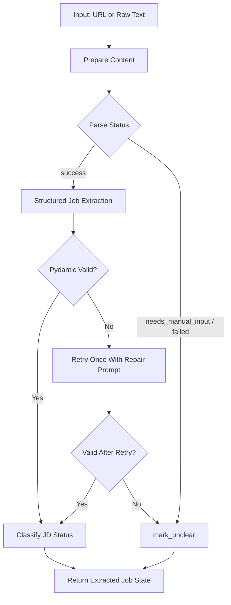

# Phase 2 Plan: AI Extraction & LangGraph

## 1. Objective

Build the AI extraction layer for the Agentic Job Matching System MVP. Phase 2 accepts public URLs or manually pasted job text, prepares clean text, extracts a structured `JobPostExtract` object with LangChain/Pydantic structured output or a Pydantic output parser, validates the result with Pydantic, retries once with a repair prompt when structured output or validation fails, and returns a controlled `unclear` fallback state for messy inputs.

Phase 2 returns graph state only. It does not decide final SQLite persistence policy.

## 2. Source of Truth

Use `docs/plans/Master_Plan.md` as the architecture source of truth, especially:

- Section 5.1: LangGraph state tracking
- Section 8: JavaScript pages and cookie banners
- Section 9: JD status rules
- Section 19: LLM fallback behavior
- Section 28: URL parsing security note
- Section 29: input size and retry limits
- Section 30: Pydantic schema sketch

If this plan conflicts with `Master_Plan.md`, follow `Master_Plan.md`.

## 3. Prerequisites from Phase 1

Assume Phase 1 already provides:

- `backend/app/core/config.py`
- `backend/app/db/session.py`
- SQLite setup using `sqlite+aiosqlite`
- root `.env` and `.env.example`
- Qdrant Local Docker Compose
- base backend folder structure

Phase 2 may add missing extraction-related config fields, but it must not rebuild Phase 1 infrastructure.

## 4. Scope

Implement and test:

- URL text extraction with `httpx` and `trafilatura`
- manual raw text extraction path
- deterministic `raw_content_hash` generation from normalized clean text
- Pydantic schema for extracted job posts
- LangChain/Pydantic structured output or LangChain `PydanticOutputParser`
- LLM extraction prompt and repair prompt
- Pydantic validation after structured extraction
- retry once with repair prompt
- `JobAgentState`
- basic LangGraph extraction workflow
- `mark_unclear` fallback
- extraction observability fields
- controlled fallback state for Phase 3 persistence handoff

## 5. Out of Scope

Do not implement:

- scoring
- skill overlap scoring
- embedding similarity
- Qdrant upsert/search/delete
- deduplication policy
- SQLite final persistence policy
- FastAPI final route layer
- React UI
- Tavily search endpoint logic
- demo seed script or mock data loading
- BeautifulSoup or a custom HTML parser
- Playwright/browser rendering

These topics may appear only as out-of-scope notes or handoff notes for Phase 3 or Phase 4.

## 6. Target Directory Structure

Create or update:

```text
backend/app/services/url_extraction_service.py
backend/app/services/content_hash.py
backend/app/services/extraction_service.py
backend/app/agents/schemas.py
backend/app/agents/prompts.py
backend/app/agents/state.py
backend/app/agents/nodes.py
backend/app/agents/graph.py
backend/app/core/config.py
backend/tests/test_url_extraction_service.py
backend/tests/test_extraction_schema.py
backend/tests/test_job_agent_graph.py
backend/tests/test_raw_content_hash.py
```

If Phase 1 did not add test dependencies, add `pytest>=8.0.0` and `pytest-asyncio>=0.23.0` to `backend/requirements.txt`.

## 7. URL Text Extraction Plan

Create `backend/app/services/url_extraction_service.py`.

Public model:

```python
from typing import Literal
from pydantic import BaseModel


class UrlExtractionResult(BaseModel):
    parse_status: Literal["success", "needs_manual_input", "failed"]
    raw_text: str | None
    clean_text: str | None
    raw_content_hash: str | None
    error_reason: str | None
    source_url: str
    source_platform: str | None = None
```

Core behavior:

- Allow only `http` and `https` URL schemes.
- Use `httpx.AsyncClient` with `timeout=settings.request_timeout_seconds`.
- Enforce `settings.max_response_size_mb` while reading the response.
- Extract readable text with `trafilatura.extract`.
- Do not introduce BeautifulSoup, `bs4`, Playwright, Selenium, or a custom HTML parser.
- Truncate clean text to `settings.max_clean_text_chars`.
- Return `parse_status="success"` only when extracted clean text is reliable enough for LLM extraction.
- Return `parse_status="needs_manual_input"` for timeout, bot protection, login pages, cookie pages, JavaScript shells, oversized responses, or low-quality extracted text.
- Return `parse_status="failed"` only for invalid URL shape, unsupported scheme, or unrecoverable internal errors.
- If URL extraction fails before usable clean text is produced, set `raw_content_hash = None`.

Low-quality detection:

- Treat extracted text shorter than `300` characters as low quality.
- Require at least one job signal such as `job`, `role`, `responsibilities`, `requirements`, `qualification`, `skills`, `salary`, `location`, `apply`, `hiring`, `intern`, `remote`, `onsite`, `tuyen`, `tuyen dung`, `mo ta`, or `yeu cau`.
- Flag page-noise signals such as `sign in`, `log in`, `captcha`, `verify you are human`, `enable javascript`, `access denied`, `cookie settings`, `cloudflare`, or `bot protection`.

Low-content hash rule:

- If extracted content is too short or unreliable and the system marks `parse_status = "needs_manual_input"`, set `raw_content_hash = None` unless there is enough reliable clean text to hash.
- When in doubt, prefer `raw_content_hash = None` for low-content URL fallback so Phase 3 does not deduplicate on unreliable page noise.

Use this warning text for unreliable URL extraction:

```text
We could not extract enough job content from this URL.
The page may require JavaScript rendering, login, or cookie acceptance.
Please paste the job description text manually.
```

## 8. Manual Text Input Plan

Manual text does not use URL quality heuristics.

Create a helper in `url_extraction_service.py` or `extraction_service.py`:

```python
def prepare_manual_text(raw_text: str) -> tuple[str | None, str | None]:
    ...
```

Behavior:

- Strip surrounding whitespace.
- If empty, return `(None, "Manual job text is empty")`.
- If longer than `settings.max_raw_text_chars`, truncate to that limit.
- Normalize repeated whitespace while preserving readable line breaks where practical.
- Truncate final clean text to `settings.max_clean_text_chars`.
- Do not reject short social posts; they may classify as `contact_for_jd`, `no_jd`, or `partial_jd`.
- If manual raw text is usable, generate `raw_content_hash` from normalized manual clean text.
- If manual raw text is empty or whitespace-only, set `raw_content_hash = None`.

Manual text terminal paths must still preserve `batch_id`, `role_profile_id`, `input_source`, `source_url`, `source_platform`, `parse_status`, and any available `raw_text` or `clean_text`.

## 8.1. Source Platform Mapping

Phase 2 must map source metadata consistently for downstream persistence:

| `input_source` | `source_platform` |
|---|---|
| `manual_url` | `manual_url` |
| `manual_text` | `manual_text` |
| `tavily` | `tavily` |
| `mock` | `mock` |

`input_source = "mock"` is allowed only as a state value so demo jobs can reuse the same downstream contract. Phase 2 must not read files from `mock_data/`, load demo records, or implement demo seeding.

## 9. Pydantic Schema Plan

Create `backend/app/agents/schemas.py`.

Required schema:

```python
from typing import Literal
from pydantic import BaseModel, ConfigDict, Field


class JobPostExtract(BaseModel):
    model_config = ConfigDict(extra="forbid")

    title: str | None = None
    company: str | None = None
    location: str | None = None
    work_mode: Literal["onsite", "remote", "hybrid", "unknown"] = "unknown"
    level: Literal["intern", "fresher", "junior", "mid", "senior", "unknown"] = "unknown"
    employment_type: Literal["internship", "full-time", "part-time", "contract", "unknown"] = "unknown"
    salary: str | None = None

    responsibilities: str | None = None
    requirements: str | None = None
    skills: list[str] = Field(default_factory=list)

    source_url: str | None = None
    source_platform: str

    jd_status: Literal["full_jd", "partial_jd", "contact_for_jd", "no_jd", "unclear"]
    should_score_similarity: bool

    extraction_notes: str | None = None
```

Also add internal result models:

- `LLMExtractionResult`: raw output if available, parsed `JobPostExtract | None`, validation error, token counts, cost estimate, elapsed time, and retry count.
- `StructuredExtractionError`: normalized error object for parser failures, Pydantic validation failures, and repair failures.

The extracted job contract is a Pydantic object contract, not a loose raw JSON contract.

## 10. LLM Extraction Prompt Plan

Create `backend/app/agents/prompts.py`.

Structured-output requirement:

```text
Use LangChain/Pydantic structured output or a Pydantic output parser to produce a `JobPostExtract` object. The output must still be validated with Pydantic. If structured output or parser validation fails, retry once with a repair prompt. If the retry fails, return a controlled `unclear` fallback state.
```

Implementation preference:

1. Prefer `ChatOpenAI(...).with_structured_output(JobPostExtract)` when supported by the selected model/provider.
2. If structured output is unavailable, use LangChain `PydanticOutputParser(pydantic_object=JobPostExtract)` and include parser format instructions in the prompt.
3. Do not use loose raw JSON parsing as the primary extraction mechanism.

Initial prompt requirements:

- Extract job data from clean text.
- Produce a schema-conformant `JobPostExtract`.
- Do not hallucinate missing fields.
- Use `None`/`null` for unknown text fields.
- Use `[]` for unknown skills.
- Classify JD completeness as `full_jd`, `partial_jd`, `contact_for_jd`, `no_jd`, or `unclear`.
- Set `should_score_similarity=true` only for `full_jd` and `partial_jd`.
- Set `should_score_similarity=false` for `contact_for_jd`, `no_jd`, and `unclear`.

Prompt inputs:

- `source_platform`
- `source_url`
- `clean_text`

Repair prompt requirements:

- Receive the invalid structured output or parser text plus the Pydantic validation error.
- Repair the output into a schema-conformant `JobPostExtract`.
- Do not add new facts.
- Preserve original extracted meaning.
- Return only output acceptable to the selected structured-output or Pydantic parser path.

## 11. Structured Output Validation and Repair Plan

Create `backend/app/services/extraction_service.py`.

Functions:

- `extract_job_structured(clean_text, source_platform, source_url)`: calls the initial structured-output chain or Pydantic parser chain.
- `repair_job_structured(invalid_output, validation_error, source_platform, source_url)`: calls the repair prompt.
- `validate_job_extract(value)`: validates or revalidates into `JobPostExtract` with Pydantic.
- `extract_with_retry(...)`: initial structured call, Pydantic validation, retry once if invalid, then fallback.

Rules:

- Use `ChatOpenAI(model=settings.openai_model, temperature=0)`.
- Do not call real OpenAI in tests; inject or monkeypatch the LLM/chain call.
- `settings.max_retry_per_job` must be `1` for MVP behavior.
- Initial structured-output success sets `extraction_status="success"`.
- Repair success sets `extraction_status="retried"`.
- Structured-output parser failure, Pydantic validation failure, or repair failure sets `extraction_status="failed"` and routes to `mark_unclear`.
- Pydantic validation is still applied after structured extraction, even when the model provider claims schema compliance.

Allowed parser fallback:

- A Pydantic output parser may internally parse JSON-like text, but Phase 2 must not depend on ad hoc `json.loads()` of arbitrary LLM text as the main extraction path.
- If a small helper is needed to inspect parser output in tests, it must feed into `JobPostExtract.model_validate(...)`.

## 12. Raw Content Hash Contract

Create `backend/app/services/content_hash.py`.

`raw_content_hash` must be generated from normalized clean text, not from raw HTML.

Normalization must include:

- trim leading/trailing whitespace
- normalize repeated whitespace
- normalize line endings
- do not lowercase unless the implementation consistently chooses to do so everywhere

Use this behavior:

```python
import hashlib
import re


def normalize_for_hash(text: str) -> str:
    text = text.replace("\r\n", "\n").replace("\r", "\n")
    text = re.sub(r"\s+", " ", text)
    return text.strip()


def build_raw_content_hash(clean_text: str | None) -> str | None:
    if not clean_text:
        return None

    normalized = normalize_for_hash(clean_text)
    if not normalized:
        return None

    return hashlib.sha256(normalized.encode("utf-8")).hexdigest()
```

Required behavior:

- Successful URL extraction: hash normalized reliable clean text.
- URL extraction fails before usable clean text: `raw_content_hash = None`.
- Low-content or unreliable URL extraction: `raw_content_hash = None` unless there is enough reliable clean text to hash.
- Usable manual raw text: hash normalized manual clean text.
- Empty or whitespace-only clean text: `raw_content_hash = None`.

Equivalent whitespace must produce the same hash. For example, these two values must hash identically after normalization:

```text
AI Engineer Intern
Python  LangChain
```

```text
AI Engineer Intern Python LangChain
```

## 13. JD Status Classification Plan

The LLM may suggest `jd_status`, but Phase 2 must normalize it deterministically after validation.

Rules:

| `jd_status` | Description | Score Later? |
|---|---|---:|
| `full_jd` | Clear responsibilities, requirements, and skills | Yes |
| `partial_jd` | Some useful JD info but incomplete | Yes |
| `contact_for_jd` | Says inbox/DM/comment for JD | No |
| `no_jd` | Hiring mention only, no useful JD | No |
| `unclear` | Extraction failed or content is unreliable | No |

Classification behavior:

- `full_jd`: responsibilities, requirements, and at least one skill are present.
- `partial_jd`: useful job information exists, but one major JD section is missing.
- `contact_for_jd`: content asks the reader to DM, inbox, comment, or contact for JD.
- `no_jd`: hiring mention exists without useful role requirements or responsibilities.
- `unclear`: extraction failed, validation failed after retry, or source text was unreliable.

Always set:

```python
should_score_similarity = jd_status in {"full_jd", "partial_jd"}
```

Do not calculate scoring, embedding similarity, skill overlap, location score, level score, base score, confidence multiplier, or final score in Phase 2.

## 14. JobAgentState Plan

Create `backend/app/agents/state.py`.

Use the Master Plan state and add internal graph fields needed for validation:

```python
from typing import Any, Literal, TypedDict


class JobAgentState(TypedDict, total=False):
    batch_id: str
    role_profile_id: str
    input_source: Literal["tavily", "manual_url", "manual_text", "mock"]

    source_url: str | None
    source_platform: str | None
    raw_text: str | None
    clean_text: str | None
    raw_content_hash: str | None

    parse_status: Literal["success", "needs_manual_input", "failed"]
    extracted_job: dict[str, Any] | None
    jd_status: Literal["full_jd", "partial_jd", "contact_for_jd", "no_jd", "unclear"] | None
    should_score_similarity: bool | None

    embedding_text: str | None
    embedding_similarity: float | None
    skill_overlap_score: float | None
    location_match_score: float | None
    level_match_score: float | None
    base_score: float | None
    jd_confidence_multiplier: float | None
    final_score: float | None
    final_score_percent: float | None

    extraction_status: Literal["success", "retried", "failed"] | None
    error_reason: str | None
    input_tokens: int | None
    output_tokens: int | None
    estimated_cost_usd: float | None
    extraction_time_ms: int | None

    llm_raw_output: str | None
    validation_error: str | None
    retry_count: int
    started_at_perf: float | None
```

Required metadata preservation:

```text
Every terminal path in the graph must preserve source metadata and required IDs.
```

This includes success, retry success, retry failure, URL failure, low-content URL, and manual text path.

Required fields to preserve where available:

```text
batch_id
role_profile_id
input_source
source_url
source_platform
raw_text
clean_text
raw_content_hash
parse_status
extraction_status
error_reason
```

At minimum, every terminal state must preserve:

```text
batch_id
role_profile_id
input_source
source_url
source_platform
parse_status
```

Add helper:

```python
REQUIRED_STATE_KEYS = ("batch_id", "role_profile_id", "input_source")
TERMINAL_METADATA_KEYS = (
    "batch_id",
    "role_profile_id",
    "input_source",
    "source_url",
    "source_platform",
    "raw_text",
    "clean_text",
    "raw_content_hash",
    "parse_status",
    "extraction_status",
    "error_reason",
)
```

Each node output starts with required identifiers and copies source metadata from input state.

`input_source = "mock"` is allowed in `JobAgentState` because demo jobs pass through the same downstream state shape. However, demo seeding and mock data loading are Phase 4 responsibilities, not Phase 2 responsibilities. Phase 2 must not read `mock_data/` files or create demo records.

## 15. LangGraph Workflow Plan

Create `backend/app/agents/nodes.py` and `backend/app/agents/graph.py`.

Mermaid diagram:



Nodes:

- `prepare_content_node`
  - URL input: call `extract_text_from_url`.
  - manual input: call `prepare_manual_text`.
  - mock input: accept pre-supplied state text from Phase 4 only; do not load mock files.
  - set `raw_text`, `clean_text`, `parse_status`, `raw_content_hash`, `source_url`, `source_platform`, and `error_reason`.
- `structured_extract_node`
  - call initial structured-output or Pydantic parser chain.
  - set `llm_raw_output` when available, token fields, cost field, and timing.
- `validate_extract_node`
  - validate into `JobPostExtract`.
  - set `extracted_job` or `validation_error`.
- `repair_extract_node`
  - retry once with repair prompt.
  - increment `retry_count`.
- `classify_jd_status_node`
  - normalize `jd_status`.
  - set `should_score_similarity`.
  - set all score fields to `None`.
- `mark_unclear`
  - return controlled fallback state with preserved metadata.

Graph edges:

- `START -> prepare_content`
- `prepare_content -> structured_extract` when `parse_status == "success"`
- `prepare_content -> mark_unclear` when `parse_status in {"needs_manual_input", "failed"}`
- `structured_extract -> validate_extract`
- `validate_extract -> classify_jd_status` when valid
- `validate_extract -> repair_extract` when invalid and `retry_count == 0`
- `validate_extract -> mark_unclear` when invalid after retry
- `repair_extract -> validate_extract`
- terminal nodes go to `END`

Every terminal path must return a state shape Phase 3 can inspect without guessing whether extraction disappeared.

## 16. Error Handling and Fallback Plan

No single page can crash a batch. Each node catches exceptions and returns a state update with `error_reason`.

Use or adapt this fallback shape:

```python
async def mark_unclear(state: JobAgentState) -> JobAgentState:
    return {
        "batch_id": state["batch_id"],
        "role_profile_id": state["role_profile_id"],
        "input_source": state["input_source"],
        "source_url": state.get("source_url"),
        "source_platform": state.get("source_platform"),
        "raw_text": state.get("raw_text"),
        "clean_text": state.get("clean_text"),
        "raw_content_hash": state.get("raw_content_hash"),
        "parse_status": state.get("parse_status") or "failed",
        "extracted_job": None,
        "jd_status": "unclear",
        "should_score_similarity": False,
        "embedding_text": None,
        "embedding_similarity": None,
        "skill_overlap_score": None,
        "location_match_score": None,
        "level_match_score": None,
        "base_score": None,
        "jd_confidence_multiplier": None,
        "final_score": None,
        "final_score_percent": None,
        "extraction_status": "failed",
        "error_reason": state.get("error_reason") or "Extraction failed before schema validation",
    }
```

Fallback requirements:

- Retry failure must return `jd_status="unclear"`.
- URL failure must return controlled fallback state, not an unhandled exception.
- Low-content URL extraction must return `parse_status="needs_manual_input"` and a controlled fallback state.
- Low-content URL fallback must include the stable warning text:
  `We could not extract enough job content from this URL. The page may require JavaScript rendering, login, or cookie acceptance. Please paste the job description text manually.`
- `should_score_similarity` must be `False`.
- All score and embedding fields must be `None`.
- Source metadata and required IDs must be preserved.

## 17. Observability Fields

Capture:

- `input_tokens`: from LangChain `usage_metadata` or response metadata; use `0` when unavailable.
- `output_tokens`: same source; use `0` when unavailable.
- `estimated_cost_usd`: best-effort helper from token counts and configured model; use `0.0` when pricing is unavailable.
- `extraction_time_ms`: measured with `time.perf_counter()` from graph start to terminal node.
- `extraction_status`: `success`, `retried`, or `failed`.
- `error_reason`: concise human-readable failure reason.

Do not add analytics tables or background aggregation jobs.

## 18. Implementation Steps

1. Update `backend/app/core/config.py` to expose `max_raw_text_chars`, `max_clean_text_chars`, `max_retry_per_job`, `request_timeout_seconds`, and `max_response_size_mb`.
2. Create `backend/app/services/content_hash.py` with `normalize_for_hash` and `build_raw_content_hash`.
3. Create `backend/app/agents/schemas.py` with `JobPostExtract` and internal extraction result models.
4. Create `backend/app/services/url_extraction_service.py` with URL validation, `httpx` fetch, response-size limiting, `trafilatura` extraction, quality checks, manual text preparation, and hash behavior.
5. Create `backend/app/agents/prompts.py` with initial extraction and repair prompt builders.
6. Create `backend/app/services/extraction_service.py` with structured-output invocation, Pydantic parser fallback, Pydantic validation, retry, JD status normalization, and observability helpers.
7. Create `backend/app/agents/state.py` with `JobAgentState` and required-key helpers.
8. Create `backend/app/agents/nodes.py` with the graph nodes.
9. Create `backend/app/agents/graph.py` with `build_job_agent_graph()`.
10. Add tests for URL extraction behavior.
11. Add tests for raw content hash stability.
12. Add tests for schema validation and JD status normalization.
13. Add tests for structured output success, parser failure, repair success, repair failure, fallback, and required state preservation.
14. Run the Phase 2 verification checklist.

## 19. Testing Plan

Create `backend/tests/test_url_extraction_service.py`:

- URL extraction success with mocked HTML and mocked `trafilatura.extract`.
- URL extraction timeout returns `parse_status="needs_manual_input"`.
- Low-content/login/captcha page returns `parse_status="needs_manual_input"`.
- URL extraction failed before clean text sets `raw_content_hash=None`.
- Invalid scheme returns `parse_status="failed"`.
- No BeautifulSoup custom parser is imported or required.

Create `backend/tests/test_raw_content_hash.py`:

- Equivalent whitespace produces the same `raw_content_hash`.
- `"AI Engineer Intern\nPython  LangChain"` and `"AI Engineer Intern Python LangChain"` produce the same hash.
- Empty string returns `None`.
- Whitespace-only string returns `None`.
- Failed URL extraction returns `raw_content_hash=None`.
- Usable manual text returns a stable hash.

Create `backend/tests/test_extraction_schema.py`:

- Pydantic schema validation success.
- Pydantic schema validation failure for invalid enum.
- Missing `source_platform` fails.
- `contact_for_jd` normalization sets `should_score_similarity=False`.
- `no_jd` normalization sets `should_score_similarity=False`.
- `unclear` normalization sets `should_score_similarity=False`.
- `full_jd` and `partial_jd` set `should_score_similarity=True`.

Create `backend/tests/test_job_agent_graph.py`:

- Manual raw text extraction path reaches validated extracted job.
- Structured output success returns `extraction_status="success"`.
- Structured output parser failure is captured without crashing.
- Pydantic validation failure triggers repair.
- Repair prompt success returns `extraction_status="retried"`.
- Repair prompt failure returns fallback `jd_status="unclear"`.
- Failed initial and repair outputs return `jd_status="unclear"`.
- Fallback to `unclear` sets `should_score_similarity=False`.
- Required state keys are preserved across every terminal graph path.
- `source_url`, `source_platform`, and `parse_status` are preserved in fallback.
- Success, retry success, retry failure, URL failure, low-content URL, and manual text paths preserve terminal metadata.
- `contact_for_jd` produces `should_score_similarity=False`.

Tests must monkeypatch LLM calls and must not call OpenAI.

Required test case coverage:

1. URL extraction success.
2. URL extraction timeout.
3. URL extraction low-content page.
4. URL extraction failed before clean text.
5. Manual raw text extraction path.
6. Structured output success.
7. Structured output parser failure.
8. Pydantic schema validation success.
9. Pydantic schema validation failure.
10. Repair prompt success.
11. Repair prompt failure.
12. Fallback to `unclear`.
13. Required state keys preserved across every terminal graph path.
14. `source_url`, `source_platform`, and `parse_status` preserved in fallback.
15. `contact_for_jd` produces `should_score_similarity=false`.
16. Equivalent whitespace produces the same `raw_content_hash`.
17. Empty/whitespace-only clean text returns `raw_content_hash=None`.

## 20. Verification Checklist

Run from `backend/`:

```powershell
.\.venv\Scripts\Activate.ps1
pytest tests/test_url_extraction_service.py tests/test_extraction_schema.py tests/test_job_agent_graph.py tests/test_raw_content_hash.py -v
```

Expected:

- all tests pass
- no real network calls except mocked URL tests
- no OpenAI API calls during tests

Manual graph compile check:

```powershell
python -c "from app.agents.graph import build_job_agent_graph; graph = build_job_agent_graph(); print(graph)"
```

Expected: graph compiles without import errors.

Dependency safety check:

```powershell
Select-String -Path requirements.txt -Pattern "beautifulsoup|bs4|playwright|selenium|psycopg2|asyncpg" -CaseSensitive
```

Expected: no matches.

Scope safety check:

```powershell
Select-String -Path app\services\*.py,app\agents\*.py -Pattern "qdrant|upsert|dedup|final_score|skill_overlap|FastAPI|APIRouter|seed_demo" -CaseSensitive
```

Expected:

- no Qdrant upsert/search/delete implementation
- no deduplication policy implementation
- no scoring implementation
- no FastAPI route layer
- no demo seed script logic
- references to score fields are allowed only for setting Phase 2 fallback fields to `None`

Hash stability check:

```powershell
pytest tests/test_raw_content_hash.py -v
```

Expected:

- equivalent whitespace hashes match
- empty and whitespace-only text return `None`
- failed extraction hash is `None`

## 21. Acceptance Criteria

- URL extraction uses `httpx` + `trafilatura`.
- No BeautifulSoup custom parser is introduced.
- Only `http` and `https` URLs are accepted.
- Low-content or unreliable URL extraction returns `parse_status = "needs_manual_input"`.
- Failed URL extraction returns controlled fallback state, not an unhandled exception.
- Pydantic structured output or a Pydantic output parser is used for job extraction.
- Pydantic validation is still applied after structured extraction.
- Invalid structured output is retried once with a repair prompt.
- Failed retry returns `jd_status = "unclear"`.
- `should_score_similarity = true` only for `full_jd` and `partial_jd`.
- `should_score_similarity = false` for `contact_for_jd`, `no_jd`, and `unclear`.
- `raw_content_hash` is generated from normalized clean text.
- Failed URL extraction sets `raw_content_hash = None` when no reliable clean text exists.
- Equivalent whitespace produces the same `raw_content_hash`.
- Every terminal graph path preserves `batch_id`, `role_profile_id`, and `input_source`.
- Every terminal graph path preserves source metadata where available.
- `needs_manual_input` returns enough fallback state for Phase 3 to persist an `unclear` pending-review job.
- Phase 3/4 must persist controlled `unclear` fallback records unless deduplication skips them.
- `input_source = "mock"` is allowed in state but demo seeding remains Phase 4.
- Phase 2 does not implement scoring, deduplication, Qdrant vector logic, final API routes, React UI, or demo seed scripts.

## 22. Expected Final State

At the end of Phase 2:

- Backend can prepare content from a public URL or raw manual text.
- URL extraction uses `httpx` and `trafilatura`.
- Low-quality URL extraction returns `needs_manual_input`.
- `raw_content_hash` is deterministic and generated from normalized clean text.
- Extraction uses Pydantic structured output or a Pydantic output parser.
- LLM output is validated by Pydantic.
- Invalid structured output is retried once with a repair prompt.
- Failed extraction returns a controlled `unclear` fallback state.
- LangGraph returns a state ready for Phase 3.
- Score fields remain `None`.
- Qdrant, deduplication, final persistence, FastAPI routes, React UI, and demo seeding remain untouched.

## 23. Handoff Notes for Phase 3

Phase 3 can consume:

- `batch_id`
- `role_profile_id`
- `input_source`
- `source_url`
- `source_platform`
- `raw_text`
- `clean_text`
- `raw_content_hash`
- `parse_status`
- `extracted_job`
- `jd_status`
- `should_score_similarity`
- `extraction_status`
- `error_reason`
- observability fields

Phase 3 should consume `raw_content_hash` from Phase 2. It may recompute the hash only when `raw_content_hash` is missing and reliable `clean_text` exists; it must not hash unreliable low-content URL fallback text.

`needs_manual_input` handoff contract:

```text
When URL extraction returns `parse_status = "needs_manual_input"`, Phase 2 must return enough fallback state for Phase 3 to persist an `unclear` pending-review job unless deduplication skips it.
```

The fallback state must preserve:

```text
batch_id
role_profile_id
input_source
source_url
source_platform
parse_status
raw_text if available
clean_text if available
raw_content_hash
jd_status = "unclear"
should_score_similarity = false
extraction_status = "failed"
error_reason
```

Phase 3 owns:

- final SQLite persistence policy
- mapping fallback state into a pending-review record
- fallback persistence for `needs_manual_input` and failed/unclear extraction states unless deduplication skips them
- building `embedding_text`
- dedup key calculation and duplicate policy
- scoring and score fields
- Qdrant collection creation and vector sync

Phase 2 must provide enough state to avoid silent failures, but Phase 2 must not write final SQLite records. Phase 3/4 decide the persistence implementation details while preserving the master rule that failed or unclear parsed jobs remain visible unless deduplication skips them.
