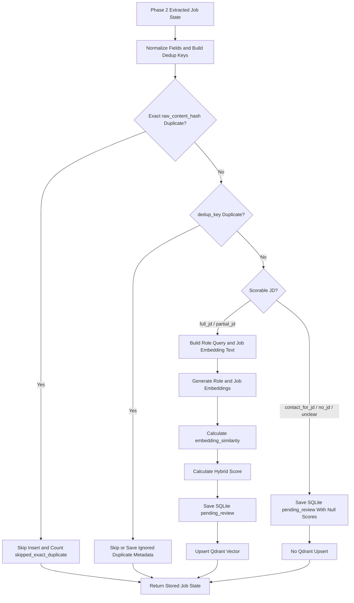

# Phase 3 Plan: Scoring & Storage Sync

## 1. Objective

Build the Phase 3 processing layer that turns Phase 2 extracted job state into persisted review records with deterministic scoring and local Qdrant synchronization.

Phase 3 owns service logic only: skill normalization, role/job embedding text, semantic similarity, hybrid scoring, JD confidence, deduplication, SQLite persistence, Qdrant collection/payload/vector behavior, SQLite to Qdrant status sync services, and LangGraph integration immediately after Phase 2 extraction.

## 2. Source of Truth

Use `docs/plans/Master_Plan.md`, especially:

- Sections 10-14: scoring formula, JD confidence, location/level scoring, skill overlap, skill aliases
- Sections 17-18: deduplication and clean embedding text
- Sections 21-26: SQLite schema/indexes, Qdrant schema, payloads, filters, and sync rules
- Section 36: database, scoring, and Qdrant implementation checklist

If this file conflicts with `Master_Plan.md`, follow `Master_Plan.md`.

## 3. Prerequisites from Phase 1 and Phase 2

Assume Phase 1 already created SQLite models/session, root `.env`, Qdrant Docker Compose, and the `role_profiles`, `job_posts`, and `applications` tables.

Assume Phase 2 already returns `JobAgentState` with:

- `batch_id`
- `role_profile_id`
- `input_source`
- `source_url`
- `source_platform`
- `clean_text`
- `raw_content_hash`
- `extracted_job`
- `jd_status`
- `should_score_similarity`
- `parse_status`
- `extraction_status`
- `error_reason`
- token/cost/timing observability fields

Phase 3 must preserve those fields when persisting successful, duplicate, non-scorable, and failed/unclear jobs.

## 4. Scope

Implement:

- skill alias normalization
- dynamic role query text generation
- clean job embedding text generation
- embedding service calls for role query text and job embedding text
- deterministic `embedding_similarity` calculation normalized to `[0, 1]`
- hybrid scoring formula
- JD confidence multiplier
- deduplication by `raw_content_hash` and `dedup_key`
- SQLite job persistence rules
- Qdrant collection setup
- Qdrant payload and filter rules
- Qdrant vector upsert/delete/update behavior
- SQLite to Qdrant status synchronization service functions
- batch summary counter preparation
- Phase 3 LangGraph integration after Phase 2 extraction state
- tests for scoring, deduplication, Qdrant behavior, storage sync, and graph integration

## 5. Out of Scope

Do not implement:

- FastAPI route layer
- final dashboard endpoint implementation
- React UI
- role profile form
- demo mode UI
- seed demo script implementation
- Tavily search endpoint implementation
- authentication
- auto-apply
- cover letter generation
- GraphRAG
- Neo4j
- Jina Reranker
- Celery/Redis
- PostgreSQL
- `role_profiles.matching_text`

These topics may appear only as out-of-scope constraints or Phase 4 handoff notes.

## 6. Target Directory Structure

Create or update:

```text
backend/app/services/scoring_service.py
backend/app/services/dedup_service.py
backend/app/services/qdrant_service.py
backend/app/services/embedding_service.py
backend/app/services/job_storage_service.py
backend/app/agents/nodes.py
backend/app/agents/graph.py
backend/app/agents/state.py
backend/app/db/models.py
backend/app/db/session.py
backend/app/core/config.py
backend/tests/test_scoring_service.py
backend/tests/test_dedup_service.py
backend/tests/test_qdrant_service.py
backend/tests/test_storage_sync.py
backend/tests/test_phase3_graph_integration.py
```

Only adjust `models.py` or `session.py` if Phase 1 implementation missed required Master Plan columns, indexes, UUID defaults, or SQLite PRAGMAs.

## 7. Skill Normalization Plan

In `backend/app/services/scoring_service.py`, define the alias dictionary exactly:

```python
SKILL_ALIASES = {
    "sqlite": "sqlite",
    "retrieval augmented generation": "rag",
    "retrieval-augmented generation": "rag",
    "large language model": "llm",
    "large language models": "llm",
    "vector database": "vector db",
    "javascript": "js",
    "typescript": "typescript",
}
```

Do not include PostgreSQL aliases.

```text
PostgreSQL is not part of this MVP stack. Do not reintroduce PostgreSQL-specific skill aliases or implementation assumptions in Phase 3.
```

Implement:

```python
def normalize_skill(skill: str) -> str:
    value = skill.strip().lower()
    return SKILL_ALIASES.get(value, value)
```

Add helpers to:

- parse role profile skills from JSON text or list input
- normalize role profile skills
- normalize extracted job skills
- remove empty strings
- compare skill sets using canonical values

## 8. Role Query Text Plan

Do not add or use `matching_text` in `role_profiles`.

Role query text must be built dynamically in `backend/app/services/scoring_service.py` from:

```text
target_role
level
location
accept_remote
skills
resume_text
```

Required pseudocode:

```python
def build_role_query_text(role_profile) -> str:
    parts = [
        f"Target role: {role_profile.target_role}" if role_profile.target_role else None,
        f"Level: {role_profile.level}" if role_profile.level else None,
        f"Location: {role_profile.location}" if role_profile.location else None,
        "Remote acceptable: yes" if role_profile.accept_remote else "Remote acceptable: no",
        f"Skills: {', '.join(role_profile.skills)}" if role_profile.skills else None,
        f"Resume: {role_profile.resume_text}" if role_profile.resume_text else None,
    ]
    return "\n".join([part for part in parts if part])
```

Implementation may normalize `role_profile.skills` before joining, but it must not persist a derived `matching_text` field.

## 9. Job Embedding Text Plan

Build clean job embedding text from extracted job fields only.

Allowed fields:

```text
title
level
location
work_mode
responsibilities
requirements
skills
tech stack, if present in the extracted schema
```

Required shape:

```python
def build_embedding_text(job) -> str:
    skills = normalize_job_skills(job.skills)
    parts = [
        f"Title: {job.title}" if job.title else None,
        f"Level: {job.level}" if job.level else None,
        f"Location: {job.location}" if job.location else None,
        f"Work mode: {job.work_mode}" if job.work_mode else None,
        f"Responsibilities: {job.responsibilities}" if job.responsibilities else None,
        f"Requirements: {job.requirements}" if job.requirements else None,
        f"Skills: {', '.join(skills)}" if skills else None,
    ]
    return "\n".join([part for part in parts if part])
```

Do not embed:

- raw HTML
- full raw page content
- page boilerplate
- legal footer text
- cookie banner text
- navigation menu text
- equal opportunity boilerplate
- unrelated page content

Raw HTML and page boilerplate are never embedded.

## 10. Semantic Similarity and Hybrid Scoring Plan

Score only jobs where `jd_status` is `full_jd` or `partial_jd`.

### Semantic Similarity Contract

`embedding_similarity` must be calculated in this exact sequence:

1. Build role query text dynamically from the role profile.
2. Generate an embedding for the role query text.
3. Build clean job embedding text from extracted job fields.
4. Generate an embedding for the job embedding text.
5. Compute similarity using cosine similarity or Qdrant equivalent score.
6. Normalize the resulting similarity to `[0, 1]`.
7. Store the normalized value in `embedding_similarity`.

Required pseudocode:

```python
def normalize_cosine_score(score: float) -> float:
    # If the embedding service or vector store already returns cosine similarity in [0, 1],
    # clamp it directly. If it returns [-1, 1], map it to [0, 1].
    if score < 0:
        score = (score + 1.0) / 2.0

    return max(0.0, min(1.0, score))


async def calculate_embedding_similarity(role_profile, job) -> float:
    role_query_text = build_role_query_text(role_profile)
    job_embedding_text = build_embedding_text(job)

    role_vector = await embedding_service.embed_text(role_query_text)
    job_vector = await embedding_service.embed_text(job_embedding_text)

    raw_score = cosine_similarity(role_vector, job_vector)
    return normalize_cosine_score(raw_score)
```

Qdrant can be used to store and retrieve job vectors, but the scoring contract must remain deterministic and normalized.

### Hybrid Formula

Use the exact MVP formula:

```text
base_score =
  0.55 * embedding_similarity
+ 0.25 * skill_overlap_score
+ 0.10 * location_match_score
+ 0.10 * level_match_score

final_score = base_score * jd_confidence_multiplier
final_score_percent = final_score * 100
```

Clamp every component to `[0, 1]`. Store all score components on `job_posts`.

Skill overlap:

```python
def calculate_skill_overlap_score(user_skills: set[str], job_required_skills: set[str]) -> float:
    if not job_required_skills:
        return 0.0
    matched = user_skills.intersection(job_required_skills)
    return len(matched) / len(job_required_skills)
```

Location scoring:

- exact normalized location match: `1.0`
- remote acceptable or partial match: `0.5`
- mismatch: `0.0`

Level scoring:

- exact level match: `1.0`
- adjacent level match: `0.5`
- mismatch: `0.0`

Use `intern < fresher < junior < mid < senior` for adjacency.

## 11. JD Confidence Multiplier Plan

Use:

| JD Status | Multiplier |
|---|---:|
| `full_jd` | `1.00` |
| `partial_jd` | `0.85` |
| `contact_for_jd` | `null` |
| `no_jd` | `null` |
| `unclear` | `null` |

Only `full_jd` and `partial_jd` are scored.

For `contact_for_jd`, `no_jd`, and `unclear`:

```text
should_score_similarity = false
embedding_text = null
embedding_similarity = null
skill_overlap_score = null
location_match_score = null
level_match_score = null
base_score = null
jd_confidence_multiplier = null
final_score = null
final_score_percent = null
status = "pending_review"
```

Do not call the embedding service and do not upsert to Qdrant for non-scorable jobs.

## 12. Deduplication Policy Plan

Deduplication must use only:

```text
raw_content_hash
dedup_key = hash(normalized_company + normalized_title)
```

Implementation may use `sha256(normalized_company + "|" + normalized_title)` for `dedup_key`, but the inputs must remain normalized company and normalized title only.

Missing or unknown company/title rule:

```text
If normalized company or normalized title is missing, empty, or equal to an unknown placeholder, set dedup_key = None.
Do not hash empty strings, "unknown", or null-equivalent values into a shared dedup key.
```

This prevents unrelated unclear jobs from collapsing into false duplicates.

```text
Qdrant/vector similarity must not be used for deduplication in MVP.
Vector-based deduplication is intentionally removed from the MVP to avoid latency, complexity, and unpredictable duplicate behavior.
```

Default policy:

- Check exact duplicate first by `raw_content_hash`.
- If `raw_content_hash` already exists, skip inserting a new row, return the existing job reference, increment `skipped_exact_duplicate`, and do not upsert Qdrant.
- If `dedup_key` already exists, inspect the existing job status.
- If `dedup_key` matches `pending_review`, skip insert or insert ignored duplicate metadata, but never create a new `pending_review` row.
- If `dedup_key` matches `saved`, `applied`, `interview`, `rejected`, or `offer`, insert ignored duplicate metadata only if `raw_content_hash` is new.
- If `dedup_key` matches `ignored`, skip insert.
- Duplicates never re-enter `pending_review`.

Duplicate metadata rows must use:

```text
duplicate_of_job_id = existing_job.id
status = "ignored"
should_score_similarity = false
embedding_text = null
embedding_similarity = null
skill_overlap_score = null
location_match_score = null
level_match_score = null
base_score = null
jd_confidence_multiplier = null
final_score = null
final_score_percent = null
```

Do not upsert duplicate metadata rows to Qdrant.

Never put duplicate jobs back into `pending_review`.

Consumer queries exclude duplicates with:

```sql
AND duplicate_of_job_id IS NULL
```

## 13. SQLite Persistence Plan

Create `backend/app/services/job_storage_service.py`.

For each Phase 2 job state:

1. Load the role profile.
2. Normalize extracted job skills.
3. Compute or receive `raw_content_hash`.
4. Compute `dedup_key` from normalized company and title.
5. Run deduplication before scoring whenever `raw_content_hash` or a valid `dedup_key` exists.
6. Persist exact duplicates as skipped, not new rows.
7. Persist duplicate metadata rows as `ignored` with all score fields null.
8. For non-duplicate scorable jobs, build `embedding_text`, compute embeddings, compute score fields, save to SQLite as `pending_review`, then upsert to Qdrant after SQLite commit.
9. For non-duplicate non-scorable jobs, save extracted fields and observability fields to SQLite as `pending_review`, with all score fields null and no Qdrant upsert.

Storage result contract:

```python
from pydantic import BaseModel


class StoredJobResult(BaseModel):
    job_id: str | None
    batch_id: str
    status: str
    dedup_action: str | None = None
    duplicate_of_job_id: str | None = None
    qdrant_sync_status: str | None = None
    warning: str | None = None
    error_reason: str | None = None
    inserted: int = 0
    scorable: int = 0
    non_scorable: int = 0
    skipped_exact_duplicate: int = 0
    duplicate_ignored: int = 0
    qdrant_upserted: int = 0
    qdrant_failed: int = 0
```

Phase 4 must consume this contract instead of reimplementing storage, scoring, deduplication, or Qdrant sync decisions.

For scorable jobs:

```text
status = "pending_review"
should_score_similarity = true
embedding_text = build_embedding_text(job)
embedding_similarity = normalized value in [0, 1]
skill_overlap_score = normalized value in [0, 1]
location_match_score = normalized value in [0, 1]
level_match_score = normalized value in [0, 1]
base_score = exact MVP formula result
jd_confidence_multiplier = 1.00 or 0.85
final_score = base_score * jd_confidence_multiplier
final_score_percent = final_score * 100
```

For non-scorable jobs with `contact_for_jd`, `no_jd`, or `unclear`:

```text
status = "pending_review"
should_score_similarity = false
embedding_text = null
embedding_similarity = null
skill_overlap_score = null
location_match_score = null
level_match_score = null
base_score = null
jd_confidence_multiplier = null
final_score = null
final_score_percent = null
```

Transaction rules:

- If SQLite save fails, do not upsert Qdrant.
- If Qdrant upsert fails after SQLite save, keep the SQLite row, increment `qdrant_failed`, and update `error_reason` with the sync failure.
- One failed Qdrant operation must not crash the whole batch.
- One failed job returns an error state for that job only.

### Batch Summary Counters

Phase 3 storage/scoring services prepare these counters:

```text
inserted
scorable
non_scorable
skipped_exact_duplicate
duplicate_ignored
qdrant_upserted
qdrant_failed
```

Definitions:

- `inserted`: number of non-duplicate jobs inserted into SQLite
- `scorable`: number of inserted jobs with `full_jd` or `partial_jd`
- `non_scorable`: number of inserted jobs with `contact_for_jd`, `no_jd`, or `unclear`
- `skipped_exact_duplicate`: number of jobs skipped because `raw_content_hash` already exists
- `duplicate_ignored`: number of duplicate metadata rows inserted as `ignored`
- `qdrant_upserted`: number of vectors successfully upserted
- `qdrant_failed`: number of Qdrant upsert/update/delete failures

Phase 3 services prepare these counters. Phase 4 exposes them through `/api/batches/{batch_id}/summary`.

Counter durability rule:

```text
Counters returned by `StoredJobResult` are authoritative for the current pipeline response.
Counters that are represented by persisted rows, such as inserted, scorable, non_scorable, duplicate_ignored, failed_extractions, tokens, and cost, may be reconstructed by Phase 4 with SQL aggregation.
Counters for skipped rows, especially skipped_exact_duplicate, are not reconstructable from `job_posts` unless Phase 4 explicitly preserves the immediate pipeline summary in memory or response payload.
Do not add a `search_runs` or batch summary table unless `Master_Plan.md` changes.
```

## 14. Qdrant Collection Plan

Create `backend/app/services/qdrant_service.py`.

Collection:

```text
job_posts
```

Rules:

- Qdrant runs locally from Docker Compose.
- Use cosine distance.
- Vector size comes from `EMBEDDING_DIMENSION`.
- Ensure collection exists before upsert/search.
- If the collection is missing, create it with cosine distance and configured vector size.
- Create and verify payload indexes for the fields listed in Section 15.

Point ID:

```text
job_posts.id
```

Validate point IDs with `uuid.UUID(job_id)` before Qdrant calls. IDs must be standard UUID strings generated with `uuid.uuid4()`, never hash strings, slugs, or custom random text.

Qdrant/vector similarity must not be used for deduplication in MVP.

## 15. Qdrant Payload and Filter Plan

Payload shape:

```json
{
  "job_id": "job_post_uuid",
  "role_profile_id": "role_profile_uuid",
  "batch_id": "batch_uuid",
  "title": "AI Engineer Intern",
  "company": "ABC AI Lab",
  "location": "Hanoi",
  "level": "intern",
  "jd_status": "full_jd",
  "status": "pending_review",
  "source_platform": "mock"
}
```

Create Qdrant payload indexes for:

```text
role_profile_id
status
jd_status
batch_id
source_platform
```

Verification requirement:

```text
After collection setup, verify these payload indexes exist or that Qdrant accepted their creation without error.
Treat missing payload indexes as a Phase 3 verification failure.
```

Filter builder:

```python
def build_pending_review_filter(role_profile_id: str) -> models.Filter:
    return models.Filter(
        must=[
            models.FieldCondition(key="role_profile_id", match=models.MatchValue(value=role_profile_id)),
            models.FieldCondition(key="status", match=models.MatchValue(value="pending_review")),
        ]
    )
```

Vector queries must be isolated by active `role_profile_id` and `status`. Ignored vectors are deleted, so ignored jobs should not appear in Qdrant results.

Qdrant filters are for retrieval/search isolation only, not deduplication.

## 16. SQLite ↔ Qdrant Sync Plan

Phase 3 owns status synchronization service functions only.

Implement service functions, not FastAPI routes:

```python
async def approve_job_sync(job_id: str) -> JobPost:
    ...


async def reject_job_sync(job_id: str) -> JobPost:
    ...


async def update_job_status_sync(job_id: str, status: str) -> JobPost:
    ...


async def delete_job_sync(job_id: str) -> None:
    ...
```

FastAPI routes that call these service functions belong to Phase 4.

SQLite remains the source of truth for job status.

Sync behavior:

| Action | SQLite action | Qdrant action |
|---|---|---|
| Approve job | `status = saved` | Update Qdrant payload `status = saved` if vector exists |
| Reject from review queue | `status = ignored` | Delete Qdrant point |
| Manual status update to `applied` | `status = applied` | Update Qdrant payload `status = applied` if vector exists |
| Manual status update to `interview` | `status = interview` | Update Qdrant payload `status = interview` if vector exists |
| Manual status update to `rejected` | `status = rejected` | Update Qdrant payload `status = rejected` if vector exists, or delete by policy |
| Manual status update to `offer` | `status = offer` | Update Qdrant payload `status = offer` if vector exists |
| Delete job | Delete SQLite row or use existing delete policy | Delete Qdrant point |

Reject/ignored deletes the vector from Qdrant.

Manual status update syncs Qdrant payload if the vector exists.

### Qdrant Vector Update Rules

For scorable jobs:

- If `embedding_text` changes for a scorable job, recompute the embedding vector and upsert the updated vector to Qdrant.
- If a job becomes non-scorable after an update, delete its vector from Qdrant.
- If a non-scorable job becomes scorable after manual correction, build embedding text, compute score, and upsert vector to Qdrant.
- If a scorable job is rejected or ignored, delete its vector from Qdrant.
- If a scorable job is approved, keep the vector and update payload `status = saved`.

## 17. LangGraph Phase 3 Integration Plan

Extend the graph after Phase 2 extraction/classification. Phase 3 starts from the extracted `JobAgentState`; it does not own URL fetching, Tavily search, manual input endpoints, or route orchestration.



Implementation can split this into focused service-backed nodes:

- `normalize_phase3_fields_node`
- `dedup_job_node`
- `score_job_node`
- `persist_job_node`
- `sync_qdrant_node`

Add state fields such as `stored_job_id`, `dedup_action`, `duplicate_of_job_id`, `qdrant_sync_status`, and batch counters if useful.

Phase 4 must call the Phase 3 processing graph or `job_storage_service.py` public contract. It must not duplicate the graph nodes, scoring formula, dedup policy, or Qdrant sync behavior inside route handlers or UI-facing orchestration.

## 18. Error Handling Plan

Handle:

- missing role profile: return failed processing state for that job
- missing job skills: `skill_overlap_score = 0.0` for scorable jobs
- missing location or level: component score `0.0` for scorable jobs
- non-scorable JD: skip embeddings and Qdrant upsert
- exact duplicate: skip active insert and skip Qdrant
- `dedup_key` duplicate: skip or save ignored duplicate metadata with all score fields null
- embedding API failure: save the job with an error reason only if the extracted job remains useful; do not upsert Qdrant
- SQLite failure: rollback and skip Qdrant
- Qdrant collection missing: create collection
- Qdrant upsert/update/delete failure: keep SQLite source of truth, increment `qdrant_failed`, and store `error_reason`
- invalid UUID point ID: fail that job only
- Qdrant connection failure: do not crash the batch

## 19. Implementation Steps

1. Update `core/config.py` only if missing `openai_embedding_model`, `embedding_dimension`, or `qdrant_url`.
2. Add `embedding_service.py` with injectable embedding client and test fake.
3. Add `scoring_service.py` with corrected skill aliases, dynamic role query text, clean job embedding text, cosine similarity normalization, component scores, JD multiplier, and exact final formula.
4. Add `dedup_service.py` with raw hash lookup, dedup key generation, duplicate action decisions, and ignored duplicate metadata builder.
5. Add `qdrant_service.py` with collection setup, payload indexes, UUID validation, upsert, delete, payload update, vector-exists checks, and filtered search helpers.
6. Add `job_storage_service.py` to orchestrate role loading, dedup, scoring, SQLite save, Qdrant sync, and batch counters.
7. Extend `agents/nodes.py` with Phase 3 processing nodes after Phase 2 extraction output.
8. Extend `agents/graph.py` to connect Phase 2 terminal extraction/classification states into Phase 3 processing.
9. Verify `models.py` already contains required Phase 3 columns and indexes; add only missing Master Plan fields.
10. Add focused tests for scoring, dedup, Qdrant, storage sync, and graph integration.

Do not add route handlers, dashboard endpoints, React components, Tavily endpoints, demo UI, or seed script implementation in Phase 3.

## 20. Testing Plan

Create or update:

```text
backend/tests/test_scoring_service.py
backend/tests/test_dedup_service.py
backend/tests/test_qdrant_service.py
backend/tests/test_storage_sync.py
backend/tests/test_phase3_graph_integration.py
```

Required test cases:

1. Skill alias normalization does not include PostgreSQL alias.
2. Skill alias normalization includes SQLite.
3. `build_role_query_text` does not use `matching_text`.
4. `build_embedding_text` excludes raw HTML and low-signal content.
5. `embedding_similarity` is normalized to `[0, 1]`.
6. Hybrid scoring formula is exact.
7. JD confidence multiplier for `full_jd`.
8. JD confidence multiplier for `partial_jd`.
9. `contact_for_jd` is saved as `pending_review` without score fields or Qdrant upsert.
10. `no_jd` is saved as `pending_review` without score fields or Qdrant upsert.
11. `unclear` is saved as `pending_review` without score fields or Qdrant upsert.
12. Exact duplicate by `raw_content_hash` is skipped.
13. Duplicate by `dedup_key` does not re-enter `pending_review`.
14. Missing or unknown company/title sets `dedup_key=None`.
15. Missing company/title jobs are not collapsed into a shared duplicate group.
16. Duplicate metadata row sets all score fields to null.
17. Duplicate metadata row is not upserted to Qdrant.
18. Qdrant/vector similarity is not called during deduplication.
19. Scorable job is saved to SQLite and upserted to Qdrant.
20. Qdrant point ID must be a valid UUID string.
21. Qdrant collection creation uses `EMBEDDING_DIMENSION`.
22. Qdrant payload indexes are created and verified.
23. Qdrant query filter uses `role_profile_id` and `status`.
24. Approve updates SQLite and Qdrant payload status.
25. Reject updates SQLite and deletes Qdrant vector.
26. Manual status update syncs Qdrant payload if vector exists.
27. `embedding_text` change recomputes vector and updates Qdrant.
28. Batch summary counters are updated correctly.
29. One failed Qdrant upsert increments `qdrant_failed` and does not crash the whole batch.

Use fake embeddings and fake Qdrant clients in normal unit tests. Do not call OpenAI or require live Qdrant in normal tests.

Suggested command:

```powershell
cd backend
.\.venv\Scripts\Activate.ps1
pytest tests/test_scoring_service.py tests/test_dedup_service.py tests/test_qdrant_service.py tests/test_storage_sync.py tests/test_phase3_graph_integration.py -v
```

## 21. Acceptance Criteria and Verification Checklist

- [ ] Skill alias dictionary does not include PostgreSQL-specific aliases.
- [ ] Skill alias dictionary includes `"sqlite": "sqlite"`.
- [ ] `matching_text` is not used or reintroduced.
- [ ] Role query text is built dynamically from role profile fields.
- [ ] Job embedding text is built only from clean job-relevant fields.
- [ ] Raw HTML and page boilerplate are never embedded.
- [ ] `embedding_similarity` calculation is explicitly defined and normalized to `[0, 1]`.
- [ ] Hybrid score uses the exact MVP formula:
  `base_score = 0.55 * embedding_similarity + 0.25 * skill_overlap_score + 0.10 * location_match_score + 0.10 * level_match_score`.
- [ ] JD confidence multiplier is applied exactly.
- [ ] Only `full_jd` and `partial_jd` are scored.
- [ ] `contact_for_jd`, `no_jd`, and `unclear` are saved but not scored.
- [ ] Qdrant/vector similarity is never used for deduplication.
- [ ] Deduplication uses only `raw_content_hash` and `dedup_key`.
- [ ] Exact duplicates are skipped.
- [ ] `dedup_key = None` when normalized company or title is missing, empty, or unknown.
- [ ] `dedup_key` duplicates never re-enter `pending_review`.
- [ ] Duplicate metadata rows set all score fields to null and `should_score_similarity = false`.
- [ ] Duplicate metadata rows are not upserted to Qdrant.
- [ ] Batch summary counters include inserted, scorable, non_scorable, skipped_exact_duplicate, duplicate_ignored, qdrant_upserted, and qdrant_failed.
- [ ] Qdrant point IDs are valid standard UUID strings.
- [ ] Qdrant collection uses cosine distance.
- [ ] Qdrant vector size comes from `EMBEDDING_DIMENSION`.
- [ ] Qdrant payload indexes are created and verified for `role_profile_id`, `status`, `jd_status`, `batch_id`, and `source_platform`.
- [ ] If `embedding_text` changes, the vector is recomputed and Qdrant is updated.
- [ ] Reject/ignored deletes the vector from Qdrant.
- [ ] Approve updates Qdrant payload status to `saved`.
- [ ] Manual status update syncs Qdrant payload if the vector exists.
- [ ] SQLite remains the source of truth for job status.
- [ ] Phase 3 exposes service functions only; FastAPI route implementation belongs to Phase 4.
- [ ] One failed job or Qdrant operation does not crash the whole batch.

## 22. Expected Final State

At the end of Phase 3:

- Extracted Phase 2 jobs can be scored and persisted.
- `full_jd` and `partial_jd` jobs get normalized hybrid scores.
- `contact_for_jd`, `no_jd`, and `unclear` jobs are saved as `pending_review` without score fields.
- Exact duplicates by `raw_content_hash` are skipped.
- `dedup_key` duplicates do not pollute the review queue.
- Duplicate metadata rows are saved as `ignored` with all score fields null.
- Scorable non-duplicate jobs are saved to SQLite and upserted to Qdrant.
- Non-scorable jobs and duplicate metadata rows are not upserted to Qdrant.
- Qdrant vector search is isolated by `role_profile_id` and `status`.
- Approve, reject, manual status update, embedding text update, scorable/non-scorable transitions, and delete operations keep SQLite and Qdrant consistent.
- Batch summary counters are prepared for Phase 4.
- Skipped exact duplicate counters are returned in the immediate pipeline result and are not assumed to be reconstructable later without a persisted summary mechanism.

## 23. Handoff Notes for Phase 4

Phase 4 can build FastAPI routes and React UI on top of Phase 3 services, but must not reimplement scoring, deduplication, storage, or Qdrant sync policy.

Phase 4 may call:

- `job_storage_service.py` for persisted pipeline results
- `approve_job_sync(job_id)`
- `reject_job_sync(job_id)`
- `update_job_status_sync(job_id, status)`
- `delete_job_sync(job_id)`
- Qdrant filtered search helpers
- batch summary counters prepared by Phase 3 services

Phase 4 must call the Phase 3 processing graph or service contract. It must not rewire scoring, deduplication, SQLite persistence, or Qdrant synchronization inside `job_pipeline_service.py`.

Phase 4 owns:

- FastAPI routes that call Phase 3 service functions
- `/api/batches/{batch_id}/summary`
- final dashboard endpoints
- React review/dashboard UI
- role profile form
- demo mode UI
- seed demo script implementation
- Tavily search endpoint implementation

Do not add new scoring formulas, duplicate policies, vector-dedup behavior, PostgreSQL assumptions, GraphRAG, Neo4j, Jina Reranker, Celery/Redis, authentication, auto-apply, or cover letter generation in Phase 4 unless the master plan changes.
